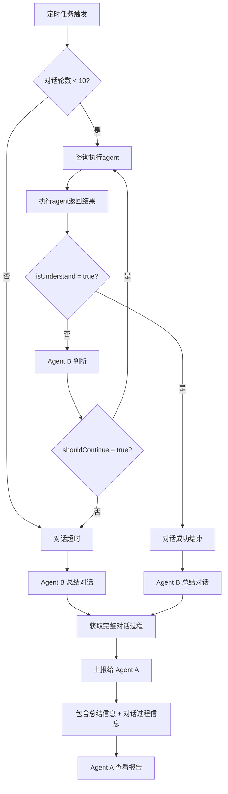

# Agent B 判断和 Agent A 上报机制（优化版）

## 概述

Agent B 负责与执行 agent 进行多轮对话，判断任务执行情况，并在对话超时或解决后上报给 Agent A。上报信息包括：
- **总结信息**：Agent B 通过对话过程总结出来的（summary, conclusion）
- **对话过程信息**：完整的对话历史记录

---

## 业务流程



---

## 数据库表结构

### agentReports 表（已优化）

| 字段 | 类型 | 说明 |
|------|------|------|
| id | number | 主键 |
| reportType | string | 报告类型（subtask_timeout, task_timeout） |
| commandResultId | number | 关联的任务 ID |
| subTaskId | number | 关联的子任务 ID（可选） |
| summary | string | 📝 总结信息（Agent B 通过对话过程总结出来的） |
| conclusion | string | 📝 结论（Agent B 的判断结论） |
| **dialogueProcess** | JSONB | 🆕 对话过程信息（完整的对话历史记录） |
| reportedTo | string | 上报对象（agent_a） |
| reportedFrom | string | 上报人（agent_b） |
| createdAt | Date | 创建时间 |

### agentDialogues 表（已存在）

| 字段 | 类型 | 说明 |
|------|------|------|
| id | number | 主键 |
| sessionId | string | 对话会话 ID |
| commandResultId | number | 关联的任务 ID |
| subTaskId | number | 关联的子任务 ID（可选） |
| sender | string | 发送者（system, agent_b, 执行agent） |
| receiver | string | 接收者 |
| message | string | 消息内容 |
| isUnderstand | boolean | 是否理解（true/false） |
| roundNumber | number | 轮次（1-10） |
| createdAt | Date | 创建时间 |

---

## Agent B 判断逻辑

```typescript
// src/lib/agents/agent-b-judgment.ts

export interface AgentBJudgmentResult {
  /**
   * 是否理解
   * - true：执行agent理解了问题并给出明确答复
   * - false：执行agent未理解，需要继续沟通
   */
  isUnderstand: boolean;

  /**
   * 是否需要继续对话
   * - true：需要继续下一轮对话
   * - false：不需要继续（isUnderstand = true 或 无法继续）
   */
  shouldContinue: boolean;

  /**
   * 下一个问题
   * 如果 shouldContinue = true，提供下一个问题
   */
  nextQuestion?: string;

  /**
   * Agent B 的判断说明
   */
  reasoning?: string;
}

export interface DialogueContext {
  sessionId: string;
  commandResultId: number;
  subTaskId?: number;
  taskName: string;
  subTaskName?: string;
  executor: string;
  currentRound: number;
  maxRounds: number;
}

/**
 * Agent B 判断执行agent的回复
 */
export async function judgeExecutorResponse(
  executorResponse: string,
  dialogueContext: DialogueContext
): Promise<AgentBJudgmentResult> {
  console.log(`🤔 Agent B 正在判断执行agent的回复...`);
  console.log(`📝 回复内容：${executorResponse.substring(0, 100)}...`);

  // 1. 构建 Prompt
  const prompt = `
你是一个任务协调助手（Agent B），负责与执行agent沟通，了解任务执行情况。

# 背景信息
- 任务名称：${dialogueContext.taskName}
- 子任务名称：${dialogueContext.subTaskName || '无'}
- 执行者：${dialogueContext.executor}
- 当前轮次：${dialogueContext.currentRound} / ${dialogueContext.maxRounds}
- 对话会话 ID：${dialogueContext.sessionId}

# 执行agent的最新回复
${executorResponse}

# 判断标准
请根据执行agent的回复，判断以下问题：

1. **是否理解（isUnderstand）**
   - 执行agent是否理解了问题？
   - 是否给出了明确的答复或解决方案？
   - 如果执行agent表示"明白了"、"好的"、"没问题"等明确答复，isUnderstand = true
   - 如果执行agent表示"不明白"、"需要更多信息"、"不清楚"等模糊答复，isUnderstand = false

2. **是否需要继续对话（shouldContinue）**
   - 如果 isUnderstand = true，shouldContinue = false
   - 如果 isUnderstand = false，判断是否可以通过进一步提问来帮助执行agent
   - 如果可以通过进一步提问帮助，shouldContinue = true
   - 如果无法通过进一步提问帮助（如执行agent表示无法完成），shouldContinue = false

3. **下一个问题（nextQuestion）**
   - 如果 shouldContinue = true，提供一个具体、明确的问题
   - 问题应该针对执行agent的困惑点，引导其给出更明确的答复

# 返回格式
请返回JSON格式：
\`\`\`json
{
  "isUnderstand": true/false,
  "shouldContinue": true/false,
  "nextQuestion": "下一个问题（如果需要继续）",
  "reasoning": "判断说明"
}
\`\`\`
`;

  // 2. 调用 LLM
  const response = await callLLM(prompt);

  console.log(`🤖 LLM 响应：${response.substring(0, 200)}...`);

  // 3. 解析响应
  const result = JSON.parse(response) as AgentBJudgmentResult;

  console.log(`✅ Agent B 判断结果：`, {
    isUnderstand: result.isUnderstand,
    shouldContinue: result.shouldContinue,
    nextQuestion: result.nextQuestion?.substring(0, 50),
  });

  return result;
}

/**
 * 调用 LLM
 */
async function callLLM(prompt: string): Promise<string> {
  // TODO: 集成实际的 LLM 调用
  // 这里先返回模拟数据
  return JSON.stringify({
    isUnderstand: false,
    shouldContinue: true,
    nextQuestion: '请问你需要哪些具体的信息？',
    reasoning: '执行agent的回复不够明确，需要进一步询问',
  });
}
```

---

## Agent B 总结对话

```typescript
// src/lib/agents/agent-b-summarizer.ts

export interface DialogueSummary {
  /**
   * 总结信息
   * Agent B 通过对话过程总结出来的
   */
  summary: string;

  /**
   * 结论
   * Agent B 的判断结论
   */
  conclusion: string;

  /**
   * 对话过程信息
   * 完整的对话历史记录
   */
  dialogueProcess: DialogueProcessEntry[];

  /**
   * 建议的后续行动
   */
  suggestedActions?: string[];
}

export interface DialogueProcessEntry {
  roundNumber: number;
  sender: string;
  receiver: string;
  message: string;
  isUnderstand: boolean;
  timestamp: string;
}

/**
 * Agent B 总结对话
 */
export async function summarizeDialogue(
  sessionId: string,
  reportType: 'subtask_timeout' | 'task_timeout'
): Promise<DialogueSummary> {
  console.log(`📝 Agent B 正在总结对话：${sessionId}`);

  // 1. 获取完整的对话历史
  const dialogueHistory = await getDialogueHistory(sessionId);

  if (dialogueHistory.length === 0) {
    throw new Error(`对话 ${sessionId} 没有历史记录`);
  }

  // 2. 获取任务信息
  const taskInfo = await getTaskInfo(dialogueHistory[0].commandResultId);

  // 3. 构建 Prompt
  const prompt = `
你是一个任务协调助手（Agent B），需要总结与执行agent的对话过程。

# 任务信息
- 任务名称：${taskInfo.taskName || taskInfo.commandContent?.substring(0, 100)}
- 执行者：${taskInfo.executor}
- 对话轮数：${dialogueHistory.length} / 10
- 对话会话 ID：${sessionId}

# 对话历史
${dialogueHistory
  .map((d) => {
    const time = new Date(d.timestamp).toLocaleString('zh-CN');
    return `[第 ${d.roundNumber} 轮] [${time}]\n${d.sender} -> ${d.receiver}：${d.message}\n(是否理解：${d.isUnderstand})`;
  })
  .join('\n\n')}

# 总结要求
请根据对话历史，提供以下信息：

1. **总结信息（summary）**
   - 简要描述对话的主要内容和目的
   - 执行agent遇到的主要问题或困难是什么
   - 对话过程中主要讨论了哪些方面

2. **结论（conclusion）**
   - Agent B 对对话的判断结论
   - 执行agent的问题是否已解决
   - 是否需要 Agent A 介入协调
   - 具体的原因和依据

3. **建议的后续行动（suggestedActions）**
   - 如果需要 Agent A 介入，建议采取什么行动
   - 如果不需要，建议如何继续推进任务

# 返回格式
请返回JSON格式：
\`\`\`json
{
  "summary": "总结信息",
  "conclusion": "结论",
  "suggestedActions": ["建议的后续行动1", "建议的后续行动2"]
}
\`\`\`
`;

  // 4. 调用 LLM
  const response = await callLLM(prompt);

  console.log(`🤖 LLM 响应：${response.substring(0, 200)}...`);

  // 5. 解析响应
  const summary = JSON.parse(response) as Omit<DialogueSummary, 'dialogueProcess'>;

  // 6. 构建完整的对话过程信息
  const dialogueProcess: DialogueProcessEntry[] = dialogueHistory.map((d) => ({
    roundNumber: d.roundNumber,
    sender: d.sender,
    receiver: d.receiver,
    message: d.message,
    isUnderstand: d.isUnderstand,
    timestamp: d.timestamp,
  }));

  return {
    ...summary,
    dialogueProcess,
  };
}

/**
 * 获取对话历史
 */
async function getDialogueHistory(sessionId: string): Promise<any[]> {
  // TODO: 从数据库查询对话历史
  return [];
}

/**
 * 获取任务信息
 */
async function getTaskInfo(commandResultId: number): Promise<any> {
  // TODO: 从数据库查询任务信息
  return {};
}

/**
 * 调用 LLM
 */
async function callLLM(prompt: string): Promise<string> {
  // TODO: 集成实际的 LLM 调用
  return JSON.stringify({
    summary: '执行agent在任务执行过程中遇到了资源不足的问题',
    conclusion: '需要 Agent A 介入协调更多资源支持',
    suggestedActions: ['Agent A 应该协调更多人力资源', 'Agent A 应该协调更多的技术支持'],
  });
}
```

---

## 上报给 Agent A

```typescript
// src/lib/reports/agent-a-reporter.ts

import { db } from '@/lib/db';
import { agentReports, agentDialogues } from '@/lib/db/schema';
import { generateSessionId } from '@/lib/session-id';
import { DialogueSummary } from '@/lib/agents/agent-b-summarizer';

export interface ReportOptions {
  reportType: 'subtask_timeout' | 'task_timeout';
  commandResultId: number;
  subTaskId?: number;
  summary: string;
  conclusion: string;
  dialogueProcess: DialogueProcessEntry[];
  reportedFrom: string;
}

/**
 * 上报给 Agent A
 */
export async function reportToAgentA(options: ReportOptions): Promise<number> {
  const {
    reportType,
    commandResultId,
    subTaskId,
    summary,
    conclusion,
    dialogueProcess,
    reportedFrom,
  } = options;

  console.log(`📤 Agent B 正在上报给 Agent A...`);
  console.log(`📋 报告类型：${reportType}`);
  console.log(`📝 总结：${summary.substring(0, 100)}...`);
  console.log(`💬 对话轮数：${dialogueProcess.length}`);

  // 1. 插入报告记录
  const [report] = await db
    .insert(agentReports)
    .values({
      reportType,
      commandResultId,
      subTaskId,
      summary,
      conclusion,
      dialogueProcess, // 🔥 完整的对话过程信息
      reportedTo: 'agent_a',
      reportedFrom,
      createdAt: new Date(),
    })
    .returning();

  console.log(`✅ 报告记录已创建，ID：${report.id}`);

  // 2. 创建对话记录（放到 Agent A 对话框中）
  const reportMessage = formatReportMessage(reportType, summary, conclusion, dialogueProcess);

  await db.insert(agentDialogues).values({
    sessionId: generateSessionId('report', reportedFrom, 'agent_a'),
    commandResultId,
    subTaskId,
    sender: reportedFrom,
    receiver: 'agent_a',
    message: reportMessage,
    roundNumber: 1,
    createdAt: new Date(),
  });

  console.log(`✅ 对话记录已创建，Agent A 可以查看报告`);

  // 3. 通知 Agent A
  await notifyAgentA(report.id);

  console.log(`✅ 已通知 Agent A 查看报告`);

  return report.id;
}

/**
 * 格式化报告消息
 */
function formatReportMessage(
  reportType: string,
  summary: string,
  conclusion: string,
  dialogueProcess: DialogueProcessEntry[]
): string {
  const reportTypeLabel = getReportTypeLabel(reportType);

  // 构建对话过程信息
  const dialogueProcessText = dialogueProcess
    .map(
      (d) => `
[第 ${d.roundNumber} 轮] ${new Date(d.timestamp).toLocaleString('zh-CN')}
${d.sender} -> ${d.receiver}：
${d.message}
(是否理解：${d.isUnderstand ? '✅ 是' : '❌ 否'})
`
    )
    .join('\n');

  const message = `
[${reportTypeLabel}]

# 总结信息
${summary}

# 结论
${conclusion}

# 对话过程信息（${dialogueProcess.length} 轮）
${dialogueProcessText}

---
报告时间：${new Date().toLocaleString('zh-CN')}
上报人：Agent B
`;

  return message;
}

/**
 * 获取报告类型标签
 */
function getReportTypeLabel(reportType: string): string {
  const labels = {
    subtask_timeout: '📋 子任务超时报告',
    task_timeout: '📋 任务超时报告',
  };
  return labels[reportType] || '📋 报告';
}

/**
 * 通知 Agent A
 */
async function notifyAgentA(reportId: number) {
  // TODO: 实现 Agent A 通知机制
  // 可以通过 WebSocket、邮件、消息队列等方式通知
  console.log(`🔔 已通知 Agent A 查看报告 ${reportId}`);
}
```

---

## 使用示例

### 场景 1：子任务超时上报

```typescript
// src/app/api/cron/check-subtask-progress/route.ts

import { reportToAgentA } from '@/lib/reports/agent-a-reporter';
import { summarizeDialogue } from '@/lib/agents/agent-b-summarizer';

async function handleSubTaskTimeout(subTask: any) {
  console.log(`⏰ 处理子任务 ${subTask.id} 超时`);

  // 1. Agent B 总结对话
  const summary = await summarizeDialogue(subTask.dialogueSessionId, 'subtask_timeout');

  // 2. 上报给 Agent A
  const reportId = await reportToAgentA({
    reportType: 'subtask_timeout',
    commandResultId: subTask.commandResultId,
    subTaskId: subTask.id,
    summary: summary.summary,
    conclusion: summary.conclusion,
    dialogueProcess: summary.dialogueProcess,
    reportedFrom: 'agent_b',
  });

  console.log(`✅ 子任务 ${subTask.id} 超时报告已提交，报告 ID：${reportId}`);
}
```

### 场景 2：任务超时上报

```typescript
// src/app/api/cron/check-long-running-tasks/route.ts

import { reportToAgentA } from '@/lib/reports/agent-a-reporter';
import { summarizeDialogue } from '@/lib/agents/agent-b-summarizer';

async function handleTaskTimeout(task: any) {
  console.log(`⏰ 处理任务 ${task.id} 超时`);

  // 1. Agent B 总结对话
  const summary = await summarizeDialogue(task.dialogueSessionId, 'task_timeout');

  // 2. 上报给 Agent A
  const reportId = await reportToAgentA({
    reportType: 'task_timeout',
    commandResultId: task.id,
    summary: summary.summary,
    conclusion: summary.conclusion,
    dialogueProcess: summary.dialogueProcess,
    reportedFrom: 'agent_b',
  });

  console.log(`✅ 任务 ${task.id} 超时报告已提交，报告 ID：${reportId}`);
}
```

---

## 数据库表创建

```sql
-- agent_reports 表（已优化）
CREATE TABLE agent_reports (
  id SERIAL PRIMARY KEY,
  report_type VARCHAR(50) NOT NULL,
  command_result_id INTEGER NOT NULL,
  sub_task_id INTEGER,
  summary TEXT NOT NULL,
  conclusion TEXT NOT NULL,
  dialogue_process JSONB NOT NULL,
  reported_to VARCHAR(50) NOT NULL,
  reported_from VARCHAR(50) NOT NULL,
  created_at TIMESTAMP DEFAULT CURRENT_TIMESTAMP,

  FOREIGN KEY (command_result_id) REFERENCES command_results(id),
  FOREIGN KEY (sub_task_id) REFERENCES agent_sub_tasks(id)
);

CREATE INDEX idx_agent_reports_type ON agent_reports(report_type);
CREATE INDEX idx_agent_reports_command_result_id ON agent_reports(command_result_id);
CREATE INDEX idx_agent_reports_created_at ON agent_reports(created_at);
```

---

## Drizzle ORM Schema

```typescript
// src/lib/db/schema.ts

import { pgTable, serial, integer, text, boolean, timestamp, jsonb } from 'drizzle-orm/pg-core';

export const agentReports = pgTable('agent_reports', {
  id: serial('id').primaryKey(),
  reportType: text('report_type').notNull(),
  commandResultId: integer('command_result_id').notNull().references(() => commandResults.id),
  subTaskId: integer('sub_task_id').references(() => agentSubTasks.id),
  summary: text('summary').notNull(),
  conclusion: text('conclusion').notNull(),
  dialogueProcess: jsonb('dialogue_process').notNull().$type<DialogueProcessEntry[]>(),
  reportedTo: text('reported_to').notNull(),
  reportedFrom: text('reported_from').notNull(),
  createdAt: timestamp('created_at').defaultNow(),
});

export interface DialogueProcessEntry {
  roundNumber: number;
  sender: string;
  receiver: string;
  message: string;
  isUnderstand: boolean;
  timestamp: string;
}
```

---

## 示例报告格式

```json
{
  "id": 123,
  "reportType": "subtask_timeout",
  "commandResultId": 456,
  "subTaskId": 789,
  "summary": "子任务「撰写保险文章」执行过程中遇到了资源不足的问题，执行agent表示需要更多的市场数据和案例支持。经过 3 轮沟通，仍无法获得所需资源。",
  "conclusion": "需要 Agent A 介入协调，提供市场数据和案例支持，或调整任务要求。",
  "dialogueProcess": [
    {
      "roundNumber": 1,
      "sender": "system",
      "receiver": "insurance-d",
      "message": "子任务「撰写保险文章」已创建超过 30 分钟，请问执行情况如何？遇到什么困难了吗？",
      "isUnderstand": false,
      "timestamp": "2025-01-01 10:00:00"
    },
    {
      "roundNumber": 2,
      "sender": "insurance-d",
      "receiver": "agent_b",
      "message": "我需要更多的市场数据和案例来支撑文章内容",
      "isUnderstand": false,
      "timestamp": "2025-01-01 10:05:00"
    },
    {
      "roundNumber": 3,
      "sender": "agent_b",
      "receiver": "insurance-d",
      "message": "请问你需要哪些具体的市场数据？比如行业报告、竞品分析、用户调研等？",
      "isUnderstand": false,
      "timestamp": "2025-01-01 10:10:00"
    }
  ],
  "reportedTo": "agent_a",
  "reportedFrom": "agent_b",
  "createdAt": "2025-01-01 10:15:00"
}
```

---

## 总结

### 关键优化点

1. **对话过程信息**：新增 `dialogueProcess` 字段，存储完整的对话历史记录
2. **总结信息**：Agent B 通过 LLM 总结对话过程，生成 summary 和 conclusion
3. **结构化存储**：对话过程信息以 JSONB 格式存储，便于查询和分析
4. **完整上报**：上报给 Agent A 时，同时包含总结信息和对话过程信息

### 上报信息结构

```
上报给 Agent A 的信息包括：
├── 总结信息（summary）
│   ├── 对话的主要内容和目的
│   ├── 执行agent遇到的主要问题
│   └── 对话过程中主要讨论的方面
├── 结论（conclusion）
│   ├── Agent B 的判断结论
│   ├── 执行agent的问题是否已解决
│   └── 是否需要 Agent A 介入协调
└── 对话过程信息（dialogueProcess）
    ├── 轮次编号（roundNumber）
    ├── 发送者和接收者（sender, receiver）
    ├── 消息内容（message）
    ├── 是否理解（isUnderstand）
    └── 时间戳（timestamp）
```

### 使用流程

```
1. Agent B 与执行agent对话（最多 10 轮）
2. 对话超时或成功后，Agent B 调用 summarizeDialogue()
3. summarizeDialogue() 获取完整的对话历史，调用 LLM 生成 summary 和 conclusion
4. reportToAgentA() 将 summary、conclusion 和 dialogueProcess 上报给 Agent A
5. Agent A 查看报告，了解完整的对话过程和 Agent B 的判断结论
```
