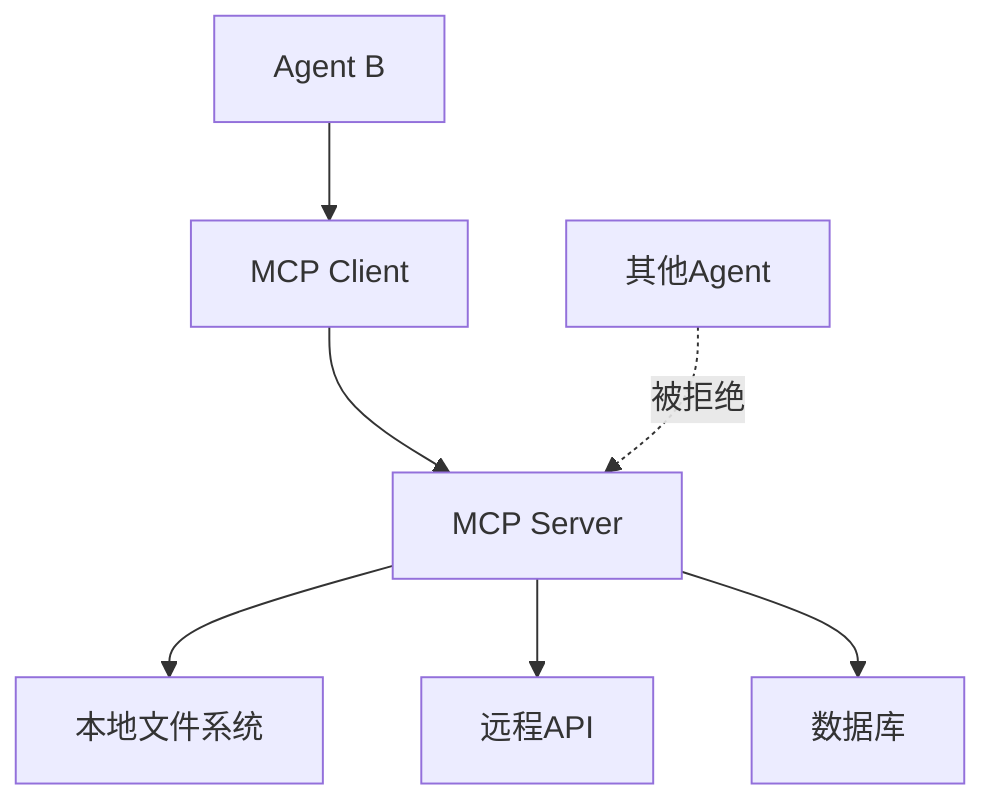

# MCP 集成方案（仅 Agent B 调用）

## 概述

MCP（Model Context Protocol）集成方案，**仅 Agent B 可以调用**，用于获取本地文件和查询远程数据。

---

## MCP 架构



---

## 安全机制

### 权限控制

```typescript
// src/lib/mcp/security.ts

import { agentReports } from '@/lib/db/schema';

export interface MCPAccessPolicy {
  agentId: string;
  allowedDirectories: string[];
  allowedDomains: string[];
  allowedTables: string[];
  maxFileSize: number;
}

/**
 * 检查访问权限
 * ⚠️ 仅允许 agent_b 访问 MCP 工具
 */
export function checkAccessPermission(
  agentId: string,
  operation: string,
  target: string
): { allowed: boolean; reason: string } {
  // 🔒 权限检查：仅允许 agent_b 访问
  if (agentId !== 'agent_b') {
    return {
      allowed: false,
      reason: `MCP 工具仅限 Agent B 使用，拒绝 Agent ${agentId} 的访问`,
    };
  }

  const policy = getAccessPolicy(agentId);

  switch (operation) {
    case 'read_file':
    case 'write_file':
      const allowed = policy.allowedDirectories.some((dir) => target.startsWith(dir));
      return {
        allowed,
        reason: allowed ? '访问允许' : '访问被拒绝：路径不在允许范围内',
      };
    case 'fetch_remote_data':
      try {
        const url = new URL(target);
        const domainAllowed = policy.allowedDomains.includes(url.hostname);
        return {
          allowed: domainAllowed,
          reason: domainAllowed ? '访问允许' : '访问被拒绝：域名不在白名单中',
        };
      } catch (error) {
        return {
          allowed: false,
          reason: '访问被拒绝：URL 格式错误',
        };
      }
    case 'query_database':
      const tableAllowed = policy.allowedTables.includes(target);
      return {
        allowed: tableAllowed,
        reason: tableAllowed ? '访问允许' : '访问被拒绝：表不在白名单中',
      };
    default:
      return {
        allowed: false,
        reason: `访问被拒绝：未知操作 ${operation}`,
      };
  }
}

/**
 * 获取 Agent B 的访问策略
 */
function getAccessPolicy(agentId: string): MCPAccessPolicy {
  // 🔒 仅返回 agent_b 的策略
  if (agentId !== 'agent_b') {
    throw new Error(`Agent ${agentId} 无 MCP 访问权限`);
  }

  return {
    agentId: 'agent_b',
    allowedDirectories: [
      '/workspace/projects',
      '/tmp',
      '/workspace/data', // Agent B 可以访问的数据目录
    ],
    allowedDomains: [
      'api.example.com',
      'data.example.com',
      'knowledge.example.com', // Agent B 可以访问的知识库
    ],
    allowedTables: [
      'command_results',
      'agent_sub_tasks',
      'agent_interactions',
      'agent_dialogues',
      'agent_reports',
    ],
    maxFileSize: 50 * 1024 * 1024, // 50 MB
  };
}

/**
 * 记录审计日志
 */
export async function logMCPAccess(
  agentId: string,
  operation: string,
  target: string,
  success: boolean,
  details?: any
) {
  // TODO: 写入审计日志表
  console.log(
    `[MCP审计] ${agentId} - ${operation} - ${target} - ${success ? '成功' : '失败'}`,
    details ? JSON.stringify(details) : ''
  );
}
```

---

## MCP Server 实现

```typescript
// src/lib/mcp/server.ts

import { MCPServer } from '@modelcontextprotocol/sdk/server';
import { StdioServerTransport } from '@modelcontextprotocol/sdk/server/stdio';
import {
  CallToolRequestSchema,
  ListToolsRequestSchema,
} from '@modelcontextprotocol/sdk/types';
import fs from 'fs/promises';
import path from 'path';
import { db } from '@/lib/db';
import { checkAccessPermission, logMCPAccess } from './security';

// 创建 MCP Server
const server = new MCPServer(
  {
    name: 'agent-b-mcp-server',
    version: '1.0.0',
  },
  {
    capabilities: {
      tools: {},
    },
  }
);

// 注册工具
server.setRequestHandler(ListToolsRequestSchema, async () => {
  return {
    tools: [
      {
        name: 'read_file',
        description: '读取本地文件内容（仅 Agent B 可用）',
        inputSchema: {
          type: 'object',
          properties: {
            path: {
              type: 'string',
              description: '文件路径',
            },
          },
          required: ['path'],
        },
      },
      {
        name: 'write_file',
        description: '写入内容到本地文件（仅 Agent B 可用）',
        inputSchema: {
          type: 'object',
          properties: {
            path: {
              type: 'string',
              description: '文件路径',
            },
            content: {
              type: 'string',
              description: '文件内容',
            },
          },
          required: ['path', 'content'],
        },
      },
      {
        name: 'list_files',
        description: '列出目录中的文件（仅 Agent B 可用）',
        inputSchema: {
          type: 'object',
          properties: {
            path: {
              type: 'string',
              description: '目录路径',
            },
            recursive: {
              type: 'boolean',
              description: '是否递归列出子目录',
              default: false,
            },
          },
          required: ['path'],
        },
      },
      {
        name: 'fetch_remote_data',
        description: '查询远程 API 数据（仅 Agent B 可用）',
        inputSchema: {
          type: 'object',
          properties: {
            url: {
              type: 'string',
              description: '远程 API URL',
            },
            method: {
              type: 'string',
              description: 'HTTP 方法（GET, POST, PUT, DELETE）',
              default: 'GET',
            },
            headers: {
              type: 'object',
              description: 'HTTP 请求头',
            },
            body: {
              type: 'object',
              description: '请求体（用于 POST/PUT）',
            },
          },
          required: ['url'],
        },
      },
      {
        name: 'query_database',
        description: '查询数据库（仅 Agent B 可用）',
        inputSchema: {
          type: 'object',
          properties: {
            table: {
              type: 'string',
              description: '表名',
            },
            where: {
              type: 'object',
              description: '查询条件（JSON 格式）',
            },
            orderBy: {
              type: 'string',
              description: '排序字段',
            },
            limit: {
              type: 'number',
              description: '返回数量限制',
              default: 10,
            },
          },
          required: ['table'],
        },
      },
    ],
  };
});

// 处理工具调用
server.setRequestHandler(CallToolRequestSchema, async (request) => {
  const { name, arguments: args } = request.params;

  // 🔒 从请求中获取 agentId（通过上下文或请求头）
  const agentId = request.context?.agentId || 'unknown';

  console.log(`[MCP] Agent ${agentId} 调用工具：${name}`);

  try {
    switch (name) {
      case 'read_file':
        return await readFile(agentId, args.path);
      case 'write_file':
        return await writeFile(agentId, args.path, args.content);
      case 'list_files':
        return await listFiles(agentId, args.path, args.recursive);
      case 'fetch_remote_data':
        return await fetchRemoteData(agentId, args);
      case 'query_database':
        return await queryDatabase(agentId, args);
      default:
        throw new Error(`Unknown tool: ${name}`);
    }
  } catch (error) {
    // 记录审计日志
    await logMCPAccess(agentId, name, args.path || args.url || args.table, false, {
      error: error instanceof Error ? error.message : '未知错误',
    });

    throw error;
  }
});

/**
 * 读取文件
 */
async function readFile(agentId: string, filePath: string) {
  // 🔒 权限检查
  const permission = checkAccessPermission(agentId, 'read_file', filePath);
  if (!permission.allowed) {
    await logMCPAccess(agentId, 'read_file', filePath, false);
    throw new Error(permission.reason);
  }

  // 解析路径
  const policy = getAccessPolicy(agentId);
  const resolvedPath = path.resolve(filePath);
  const isAllowed = policy.allowedDirectories.some((dir) =>
    resolvedPath.startsWith(path.resolve(dir))
  );

  if (!isAllowed) {
    await logMCPAccess(agentId, 'read_file', filePath, false);
    throw new Error(`访问被拒绝：${filePath}`);
  }

  // 读取文件
  const content = await fs.readFile(resolvedPath, 'utf-8');

  await logMCPAccess(agentId, 'read_file', filePath, true, {
    fileSize: content.length,
  });

  return {
    content: [
      {
        type: 'text',
        text: content,
      },
    ],
  };
}

/**
 * 写入文件
 */
async function writeFile(agentId: string, filePath: string, content: string) {
  // 🔒 权限检查
  const permission = checkAccessPermission(agentId, 'write_file', filePath);
  if (!permission.allowed) {
    await logMCPAccess(agentId, 'write_file', filePath, false);
    throw new Error(permission.reason);
  }

  // 解析路径
  const policy = getAccessPolicy(agentId);
  const resolvedPath = path.resolve(filePath);
  const isAllowed = policy.allowedDirectories.some((dir) =>
    resolvedPath.startsWith(path.resolve(dir))
  );

  if (!isAllowed) {
    await logMCPAccess(agentId, 'write_file', filePath, false);
    throw new Error(`访问被拒绝：${filePath}`);
  }

  // 确保目录存在
  const dir = path.dirname(resolvedPath);
  await fs.mkdir(dir, { recursive: true });

  // 写入文件
  await fs.writeFile(resolvedPath, content, 'utf-8');

  await logMCPAccess(agentId, 'write_file', filePath, true, {
    fileSize: content.length,
  });

  return {
    content: [
      {
        type: 'text',
        text: `文件已写入：${resolvedPath}`,
      },
    ],
  };
}

/**
 * 列出文件
 */
async function listFiles(agentId: string, dirPath: string, recursive: boolean = false) {
  // 🔒 权限检查
  const permission = checkAccessPermission(agentId, 'list_files', dirPath);
  if (!permission.allowed) {
    await logMCPAccess(agentId, 'list_files', dirPath, false);
    throw new Error(permission.reason);
  }

  // 解析路径
  const policy = getAccessPolicy(agentId);
  const resolvedPath = path.resolve(dirPath);
  const isAllowed = policy.allowedDirectories.some((dir) =>
    resolvedPath.startsWith(path.resolve(dir))
  );

  if (!isAllowed) {
    await logMCPAccess(agentId, 'list_files', dirPath, false);
    throw new Error(`访问被拒绝：${dirPath}`);
  }

  // 列出文件
  const files = await listDirectory(resolvedPath, recursive);

  await logMCPAccess(agentId, 'list_files', dirPath, true, {
    fileCount: files.length,
    recursive,
  });

  return {
    content: [
      {
        type: 'text',
        text: JSON.stringify(files, null, 2),
      },
    ],
  };
}

/**
 * 列出目录（递归）
 */
async function listDirectory(dirPath: string, recursive: boolean): Promise<string[]> {
  const files: string[] = [];
  const entries = await fs.readdir(dirPath, { withFileTypes: true });

  for (const entry of entries) {
    const fullPath = path.join(dirPath, entry.name);
    files.push(fullPath);

    if (entry.isDirectory() && recursive) {
      const subFiles = await listDirectory(fullPath, recursive);
      files.push(...subFiles);
    }
  }

  return files;
}

/**
 * 查询远程数据
 */
async function fetchRemoteData(agentId: string, args: any) {
  const { url, method = 'GET', headers = {}, body } = args;

  // 🔒 权限检查
  const permission = checkAccessPermission(agentId, 'fetch_remote_data', url);
  if (!permission.allowed) {
    await logMCPAccess(agentId, 'fetch_remote_data', url, false);
    throw new Error(permission.reason);
  }

  // 发起请求
  const response = await fetch(url, {
    method,
    headers: {
      'Content-Type': 'application/json',
      ...headers,
    },
    body: body ? JSON.stringify(body) : undefined,
  });

  if (!response.ok) {
    throw new Error(`HTTP ${response.status}: ${response.statusText}`);
  }

  const data = await response.json();

  await logMCPAccess(agentId, 'fetch_remote_data', url, true, {
    method,
    responseSize: JSON.stringify(data).length,
  });

  return {
    content: [
      {
        type: 'text',
        text: JSON.stringify(data, null, 2),
      },
    ],
  };
}

/**
 * 查询数据库
 */
async function queryDatabase(agentId: string, args: any) {
  const { table, where = {}, orderBy, limit = 10 } = args;

  // 🔒 权限检查
  const permission = checkAccessPermission(agentId, 'query_database', table);
  if (!permission.allowed) {
    await logMCPAccess(agentId, 'query_database', table, false);
    throw new Error(permission.reason);
  }

  // 查询数据库
  // TODO: 实现通用数据库查询逻辑
  // const results = await db.query(table, where, orderBy, limit);

  const results = []; // 占位

  await logMCPAccess(agentId, 'query_database', table, true, {
    where,
    limit,
    resultCount: results.length,
  });

  return {
    content: [
      {
        type: 'text',
        text: JSON.stringify(results, null, 2),
      },
    ],
  };
}

/**
 * 启动 MCP Server
 */
export async function startMCPServer() {
  const transport = new StdioServerTransport();
  await server.connect(transport);
  console.log('🔧 Agent B MCP Server 已启动');
}
```

---

## Agent B MCP Client

```typescript
// src/lib/agents/agent-b-mcp-client.ts

import { MCPClient } from '@modelcontextprotocol/sdk/client';

/**
 * Agent B 专属 MCP 客户端
 */
export class AgentBMCPClient {
  private client: MCPClient;
  private connected: boolean = false;

  constructor() {
    this.client = new MCPClient();
  }

  /**
   * 连接 MCP Server
   */
  async connect() {
    if (this.connected) {
      return;
    }

    await this.client.connect({
      command: 'node',
      args: ['/workspace/projects/src/lib/mcp/server.js'],
      env: {
        AGENT_ID: 'agent_b',
      },
    });

    this.connected = true;
    console.log('🔧 Agent B 已连接到 MCP Server');
  }

  /**
   * 读取文件
   */
  async readFile(filePath: string): Promise<string> {
    await this.connect();

    console.log(`📖 Agent B 正在读取文件：${filePath}`);

    const result = await this.client.callTool({
      name: 'read_file',
      arguments: { path: filePath },
    });

    console.log(`✅ Agent B 成功读取文件：${filePath}`);

    return result.content[0].text;
  }

  /**
   * 写入文件
   */
  async writeFile(filePath: string, content: string): Promise<void> {
    await this.connect();

    console.log(`✍️ Agent B 正在写入文件：${filePath}`);

    await this.client.callTool({
      name: 'write_file',
      arguments: { path: filePath, content },
    });

    console.log(`✅ Agent B 成功写入文件：${filePath}`);
  }

  /**
   * 列出文件
   */
  async listFiles(dirPath: string, recursive: boolean = false): Promise<string[]> {
    await this.connect();

    console.log(`📁 Agent B 正在列出文件：${dirPath}`);

    const result = await this.client.callTool({
      name: 'list_files',
      arguments: { path: dirPath, recursive },
    });

    const files = JSON.parse(result.content[0].text);

    console.log(`✅ Agent B 成功列出文件，共 ${files.length} 个`);

    return files;
  }

  /**
   * 查询远程数据
   */
  async fetchRemoteData(
    url: string,
    method: string = 'GET',
    headers: Record<string, string> = {},
    body?: any
  ): Promise<any> {
    await this.connect();

    console.log(`🌐 Agent B 正在查询远程数据：${url}`);

    const result = await this.client.callTool({
      name: 'fetch_remote_data',
      arguments: { url, method, headers, body },
    });

    const data = JSON.parse(result.content[0].text);

    console.log(`✅ Agent B 成功查询远程数据：${url}`);

    return data;
  }

  /**
   * 查询数据库
   */
  async queryDatabase(
    table: string,
    where: Record<string, any> = {},
    orderBy?: string,
    limit: number = 10
  ): Promise<any[]> {
    await this.connect();

    console.log(`🗄️ Agent B 正在查询数据库表：${table}`);

    const result = await this.client.callTool({
      name: 'query_database',
      arguments: { table, where, orderBy, limit },
    });

    const data = JSON.parse(result.content[0].text);

    console.log(`✅ Agent B 成功查询数据库，返回 ${data.length} 条记录`);

    return data;
  }

  /**
   * 断开连接
   */
  async disconnect() {
    if (this.connected) {
      await this.client.close();
      this.connected = false;
      console.log('🔌 Agent B 已断开 MCP 连接');
    }
  }
}

/**
 * Agent B 单例 MCP 客户端
 */
let agentBMCPClient: AgentBMCPClient | null = null;

export function getAgentBMCPClient(): AgentBMCPClient {
  if (!agentBMCPClient) {
    agentBMCPClient = new AgentBMCPClient();
  }
  return agentBMCPClient;
}
```

---

## 使用示例

```typescript
// Agent B 使用 MCP 读取本地文件

import { getAgentBMCPClient } from '@/lib/agents/agent-b-mcp-client';

export async function agentBReadTaskLogs(taskId: number) {
  const mcpClient = getAgentBMCPClient();

  // 读取任务日志文件
  const logContent = await mcpClient.readFile(`/workspace/data/tasks/${taskId}.log`);

  console.log('任务日志：', logContent);

  return logContent;
}

// Agent B 使用 MCP 查询数据库

export async function agentBQueryStuckTasks() {
  const mcpClient = getAgentBMCPClient();

  // 查询卡住的任务
  const stuckTasks = await mcpClient.queryDatabase(
    'command_results',
    {
      executionStatus: 'in_progress',
    },
    'createdAt',
    10
  );

  console.log('卡住的任务：', stuckTasks);

  return stuckTasks;
}

// Agent B 使用 MCP 查询远程数据

export async function agentBFetchKnowledge(topic: string) {
  const mcpClient = getAgentBMCPClient();

  // 从知识库 API 查询
  const knowledge = await mcpClient.fetchRemoteData(
    `https://knowledge.example.com/api/topic?name=${encodeURIComponent(topic)}`,
    'GET'
  );

  console.log('知识库内容：', knowledge);

  return knowledge;
}
```

---

## 审计日志表

```sql
CREATE TABLE mcp_audit_logs (
  id SERIAL PRIMARY KEY,
  agent_id VARCHAR(50) NOT NULL,
  operation VARCHAR(50) NOT NULL,
  target VARCHAR(500) NOT NULL,
  success BOOLEAN NOT NULL,
  details JSONB,
  created_at TIMESTAMP DEFAULT CURRENT_TIMESTAMP
);

CREATE INDEX idx_mcp_audit_logs_agent_id ON mcp_audit_logs(agent_id);
CREATE INDEX idx_mcp_audit_logs_operation ON mcp_audit_logs(operation);
CREATE INDEX idx_mcp_audit_logs_created_at ON mcp_audit_logs(created_at);
```

---

## 总结

### 关键特性

1. **权限控制**：仅 Agent B 可以调用 MCP 工具
2. **路径安全**：限制可访问的目录
3. **域名白名单**：限制可访问的远程 API
4. **表白名单**：限制可查询的数据库表
5. **审计日志**：记录所有 MCP 调用
6. **单例模式**：Agent B 使用单例 MCP 客户端

### 可用工具

| 工具 | 描述 | 仅 Agent B |
|------|------|-----------|
| `read_file` | 读取本地文件 | ✅ |
| `write_file` | 写入本地文件 | ✅ |
| `list_files` | 列出目录中的文件 | ✅ |
| `fetch_remote_data` | 查询远程 API 数据 | ✅ |
| `query_database` | 查询数据库 | ✅ |

### 安全机制

- 🔒 **权限检查**：每次调用都检查 Agent ID
- 🔒 **路径验证**：只允许访问指定目录
- 🔒 **域名验证**：只允许访问白名单域名
- 🔒 **表验证**：只允许查询白名单表
- 🔒 **审计日志**：记录所有调用记录
