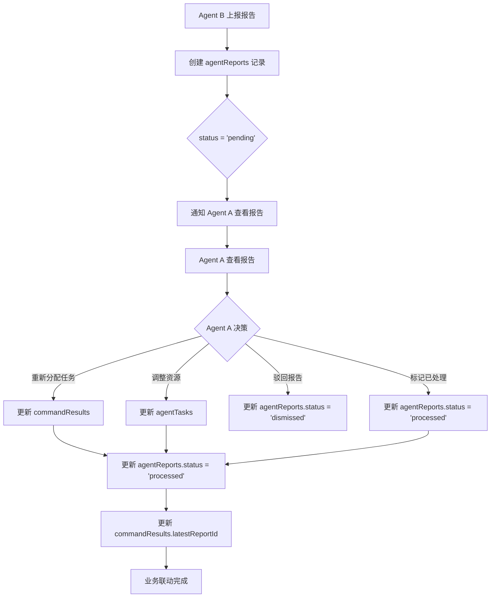

# agentReports 与 commandResults 业务联动设计

## 概述

本文档详细设计 `agentReports`（上报报告表）与 `commandResults`（执行结果表）的业务联动机制，确保报告能够触发后续的业务流程。

---

## 业务场景

### 场景 1：子任务超时上报
```
1. 子任务执行超时
2. Agent B 与执行 agent 对话（最多 10 轮）
3. Agent B 总结对话，生成报告
4. Agent B 上报给 Agent A
5. Agent A 查看报告，决定是否需要重新分配任务
```

### 场景 2：任务超时上报
```
1. 任务执行超过 1 天
2. Agent B 与执行 agent 对话（最多 10 轮）
3. Agent B 总结对话，生成报告
4. Agent B 上报给 Agent A
5. Agent A 查看报告，决定是否需要调整资源
```

---

## 业务联动方案

### 方案概述

采用 **状态联动 + 回调机制** 的组合方案：

1. **状态联动**：通过 `status` 字段跟踪报告处理状态
2. **回调机制**：通过 `onReview` 回调触发后续业务逻辑
3. **关联机制**：通过 `commandResultId` 和 `reportId` 双向关联

---

## 数据库表设计

### agentReports 表（优化版）

| 字段 | 类型 | 说明 |
|------|------|------|
| id | UUID | 主键 |
| reportType | VARCHAR(50) | 报告类型（'subtask_timeout' | 'task_timeout'） |
| commandResultId | UUID | 关联的指令 ID（外键） |
| subTaskId | UUID | 关联的子任务 ID（可选，外键） |
| summary | TEXT | 总结信息 |
| conclusion | TEXT | 结论 |
| dialogueProcess | JSONB | 对话过程信息 |
| suggestedActions | JSONB | 建议的后续行动（数组） |
| reportedTo | VARCHAR(50) | 上报对象（'agent_a'） |
| reportedFrom | VARCHAR(50) | 上报人（'agent_b'） |
| **status** | VARCHAR(50) | 🆕 报告状态（'pending' | 'reviewed' | 'processing' | 'processed' | 'dismissed'） |
| **reviewedBy** | VARCHAR(50) | 🆕 审核人 |
| **reviewedAt** | TIMESTAMP | 🆕 审核时间 |
| **processedBy** | VARCHAR(50) | 🆕 处理人 |
| **processedAt** | TIMESTAMP | 🆕 处理时间 |
| **processedActions** | JSONB | 🆕 实际执行的行动（数组） |
| **dismissedReason** | TEXT | 🆕 驳回原因 |
| **relatedTaskId** | UUID | 🆕 关联的任务 ID（外键关联 agentTasks） |
| createdAt | TIMESTAMP | 创建时间 |
| updatedAt | TIMESTAMP | 更新时间 |

### commandResults 表（新增字段）

| 字段 | 类型 | 说明 |
|------|------|------|
| ... | ... | ...（现有字段） |
| **latestReportId** | UUID | 🆕 最新报告 ID（外键关联 agentReports） |
| **reportCount** | INTEGER | 🆕 报告数量 |
| **requiresIntervention** | BOOLEAN | 🆕 是否需要 Agent A 介入 |

---

## 业务联动流程

### 流程图



---

## API 设计

### 1. Agent A 查看待处理报告

```
GET /api/reports/pending
```

**返回示例**：
```json
{
  "success": true,
  "reports": [
    {
      "id": "report-uuid-1",
      "reportType": "subtask_timeout",
      "commandResultId": "command-uuid-1",
      "subTaskId": "subtask-uuid-1",
      "summary": "子任务「撰写保险文章」执行过程中遇到了资源不足的问题...",
      "conclusion": "需要 Agent A 介入协调，提供市场数据和案例支持",
      "dialogueProcess": [...],
      "suggestedActions": [
        "Agent A 应该协调更多人力资源",
        "Agent A 应该协调更多的技术支持"
      ],
      "reportedFrom": "agent_b",
      "status": "pending",
      "createdAt": "2025-01-01 10:15:00"
    }
  ],
  "total": 1
}
```

---

### 2. Agent A 标记报告已审核

```
POST /api/reports/[id]/review
```

**请求体**：
```json
{
  "reviewedBy": "agent_a"
}
```

**返回示例**：
```json
{
  "success": true,
  "reportId": "report-uuid-1",
  "status": "reviewed",
  "message": "报告已标记为已审核"
}
```

---

### 3. Agent A 获取处理建议

```
GET /api/reports/[id]/suggestions
```

**返回示例**：
```json
{
  "success": true,
  "reportId": "report-uuid-1",
  "suggestedActions": [
    {
      "action": "reassign_task",
      "description": "重新分配任务给其他 agent",
      "targetAgentId": "insurance-c",
      "priority": "high"
    },
    {
      "action": "adjust_resources",
      "description": "调整资源配置",
      "resources": ["market_data", "case_studies"],
      "priority": "medium"
    }
  ]
}
```

---

### 4. Agent A 执行处理行动

```
POST /api/reports/[id]/process
```

**请求体**：
```json
{
  "processedBy": "agent_a",
  "actions": [
    {
      "action": "reassign_task",
      "targetAgentId": "insurance-c"
    },
    {
      "action": "adjust_resources",
      "resources": ["market_data", "case_studies"]
    }
  ]
}
```

**返回示例**：
```json
{
  "success": true,
  "reportId": "report-uuid-1",
  "status": "processed",
  "processedActions": [
    {
      "action": "reassign_task",
      "targetAgentId": "insurance-c",
      "result": "success",
      "taskId": "task-insurance-c-001"
    },
    {
      "action": "adjust_resources",
      "resources": ["market_data", "case_studies"],
      "result": "success",
      "resourceIds": ["res-001", "res-002"]
    }
  ],
  "message": "报告处理完成"
}
```

---

### 5. Agent A 驳回报告

```
POST /api/reports/[id]/dismiss
```

**请求体**：
```json
{
  "dismissedBy": "agent_a",
  "reason": "执行agent 已自行解决问题"
}
```

**返回示例**：
```json
{
  "success": true,
  "reportId": "report-uuid-1",
  "status": "dismissed",
  "message": "报告已驳回"
}
```

---

## 回调机制

### onReview 回调

当 Agent A 标记报告为 `reviewed` 或 `processed` 时，触发回调：

```typescript
// src/lib/reports/report-callbacks.ts

export interface ReportCallbackContext {
  reportId: string;
  reportType: 'subtask_timeout' | 'task_timeout';
  commandResultId: string;
  subTaskId?: string;
  status: string;
  processedBy: string;
  processedActions: any[];
}

/**
 * 报告处理回调
 */
export async function onReportProcessed(context: ReportCallbackContext) {
  console.log(`🔔 报告 ${context.reportId} 已处理，触发回调`);

  switch (context.reportType) {
    case 'subtask_timeout':
      await handleSubTaskTimeoutReport(context);
      break;
    case 'task_timeout':
      await handleTaskTimeoutReport(context);
      break;
    default:
      console.error(`未知的报告类型：${context.reportType}`);
  }
}

/**
 * 处理子任务超时报告
 */
async function handleSubTaskTimeoutReport(context: ReportCallbackContext) {
  console.log(`📋 处理子任务超时报告：${context.reportId}`);

  // 1. 更新 commandResults 表
  await db.update(commandResults)
    .set({
      latestReportId: context.reportId,
      reportCount: sql`report_count + 1`,
      updatedAt: new Date(),
    })
    .where(eq(commandResults.id, context.commandResultId));

  // 2. 检查是否需要重新分配任务
  const hasReassignAction = context.processedActions.some(
    (action) => action.action === 'reassign_task'
  );

  if (hasReassignAction) {
    const reassignAction = context.processedActions.find(
      (action) => action.action === 'reassign_task'
    );

    // 3. 重新分配任务
    await reassignSubTask(context.subTaskId!, reassignAction.targetAgentId);

    console.log(`✅ 子任务 ${context.subTaskId} 已重新分配给 ${reassignAction.targetAgentId}`);
  }

  // 4. 通知相关 Agent
  await notifyRelatedAgents(context);
}

/**
 * 处理任务超时报告
 */
async function handleTaskTimeoutReport(context: ReportCallbackContext) {
  console.log(`📋 处理任务超时报告：${context.reportId}`);

  // 1. 更新 commandResults 表
  await db.update(commandResults)
    .set({
      latestReportId: context.reportId,
      reportCount: sql`report_count + 1`,
      updatedAt: new Date(),
    })
    .where(eq(commandResults.id, context.commandResultId));

  // 2. 检查是否需要调整资源
  const hasAdjustResourcesAction = context.processedActions.some(
    (action) => action.action === 'adjust_resources'
  );

  if (hasAdjustResourcesAction) {
    const adjustResourcesAction = context.processedActions.find(
      (action) => action.action === 'adjust_resources'
    );

    // 3. 调整资源
    await adjustTaskResources(context.commandResultId, adjustResourcesAction.resources);

    console.log(`✅ 任务 ${context.commandResultId} 资源已调整`);
  }

  // 4. 通知相关 Agent
  await notifyRelatedAgents(context);
}

/**
 * 重新分配子任务
 */
async function reassignSubTask(subTaskId: string, targetAgentId: string) {
  // TODO: 实现子任务重新分配逻辑
  console.log(`重新分配子任务 ${subTaskId} 给 ${targetAgentId}`);
}

/**
 * 调整任务资源
 */
async function adjustTaskResources(commandResultId: string, resources: string[]) {
  // TODO: 实现资源调整逻辑
  console.log(`调整任务 ${commandResultId} 的资源：${resources.join(', ')}`);
}

/**
 * 通知相关 Agent
 */
async function notifyRelatedAgents(context: ReportCallbackContext) {
  // TODO: 实现通知逻辑
  console.log(`通知相关 Agent 关于报告 ${context.reportId}`);
}
```

---

## 状态流转

### 报告状态流转

```
pending（待审核）
  ↓
  ├─→ reviewed（已审核）
  │     ↓
  │     ├─→ processing（处理中）
  │     │     ↓
  │     │     └─→ processed（已处理）
  │     │
  │     └─→ dismissed（已驳回）
  │
  └─→ dismissed（已驳回）
```

### 状态转换规则

| 当前状态 | 目标状态 | 触发条件 | 必填字段 |
|---------|---------|---------|---------|
| `pending` | `reviewed` | Agent A 查看完报告 | `reviewedBy`, `reviewedAt` |
| `reviewed` | `processing` | Agent A 开始处理 | - |
| `processing` | `processed` | Agent A 完成处理 | `processedBy`, `processedAt`, `processedActions` |
| `reviewed` | `dismissed` | Agent A 驳回报告 | `dismissedReason` |
| `pending` | `dismissed` | Agent A 直接驳回 | `dismissedReason` |

---

## Drizzle ORM Schema

```typescript
// src/lib/db/schema.ts

export const agentReports = pgTable('agent_reports', {
  id: uuid('id').primaryKey().defaultRandom(),
  reportType: text('report_type').notNull(), // 'subtask_timeout' | 'task_timeout'
  commandResultId: uuid('command_result_id').notNull().references(() => commandResults.id, { onDelete: 'cascade' }),
  subTaskId: uuid('sub_task_id').references(() => agentSubTasks.id, { onDelete: 'cascade' }),
  summary: text('summary').notNull(),
  conclusion: text('conclusion').notNull(),
  dialogueProcess: jsonb('dialogue_process').notNull().$type<DialogueProcessEntry[]>(),
  suggestedActions: jsonb('suggested_actions').notNull().$type<SuggestedAction[]>(),
  reportedTo: text('reported_to').notNull(), // 'agent_a'
  reportedFrom: text('reported_from').notNull(), // 'agent_b',

  // === 新增：状态管理字段 ===
  status: text('status').notNull().default('pending'), // 'pending' | 'reviewed' | 'processing' | 'processed' | 'dismissed'
  reviewedBy: text('reviewed_by'),
  reviewedAt: timestamp('reviewed_at'),
  processedBy: text('processed_by'),
  processedAt: timestamp('processed_at'),
  processedActions: jsonb('processed_actions').$type<ProcessedAction[]>().default([]),
  dismissedReason: text('dismissed_reason'),
  relatedTaskId: uuid('related_task_id').references(() => agentTasks.id),

  createdAt: timestamp('created_at').notNull().defaultNow(),
  updatedAt: timestamp('updated_at').notNull().defaultNow(),
});

export interface SuggestedAction {
  action: string; // 'reassign_task' | 'adjust_resources' | 'escalate' | 'dismiss'
  description: string;
  targetAgentId?: string;
  resources?: string[];
  priority: 'high' | 'medium' | 'low';
}

export interface ProcessedAction {
  action: string;
  result: 'success' | 'failed' | 'skipped';
  targetAgentId?: string;
  resources?: string[];
  taskId?: string;
  resourceIds?: string[];
  error?: string;
}

// 修改 commandResults 表定义，新增报告相关字段
export const commandResults = pgTable('command_results', {
  // ... 现有字段 ...

  // === 新增：报告管理字段 ===
  latestReportId: uuid('latest_report_id').references(() => agentReports.id),
  reportCount: integer('report_count').notNull().default(0),
  requiresIntervention: pgBoolean('requires_intervention').notNull().default(false),
});
```

---

## 使用示例

### 场景 1：Agent B 上报子任务超时报告

```typescript
// 1. Agent B 总结对话
const summary = await summarizeDialogue(sessionId, 'subtask_timeout');

// 2. Agent B 上报给 Agent A
const reportId = await reportToAgentA({
  reportType: 'subtask_timeout',
  commandResultId: subTask.commandResultId,
  subTaskId: subTask.id,
  summary: summary.summary,
  conclusion: summary.conclusion,
  dialogueProcess: summary.dialogueProcess,
  suggestedActions: summary.suggestedActions,
  reportedFrom: 'agent_b',
});

console.log(`📤 报告已上报，ID：${reportId}`);
```

### 场景 2：Agent A 查看待处理报告

```typescript
// 1. Agent A 查看待处理报告
const response = await fetch('/api/reports/pending');
const data = await response.json();

console.log(`📋 有 ${data.total} 个待处理报告`);

// 2. Agent A 查看第一个报告
const report = data.reports[0];
console.log(`报告内容：`, report);

// 3. Agent A 标记报告已审核
await fetch(`/api/reports/${report.id}/review`, {
  method: 'POST',
  body: JSON.stringify({ reviewedBy: 'agent_a' }),
});
```

### 场景 3：Agent A 执行处理行动

```typescript
// 1. Agent A 获取处理建议
const suggestionsResponse = await fetch(`/api/reports/${report.id}/suggestions`);
const suggestionsData = await suggestionsResponse.json();

console.log(`建议行动：`, suggestionsData.suggestedActions);

// 2. Agent A 执行处理行动
await fetch(`/api/reports/${report.id}/process`, {
  method: 'POST',
  body: JSON.stringify({
    processedBy: 'agent_a',
    actions: suggestionsData.suggestedActions,
  }),
});

// 3. 触发回调，自动更新 commandResults 表
// 4. 自动通知相关 Agent
```

---

## 总结

### 业务联动机制

| 机制 | 说明 | 实现方式 |
|------|------|---------|
| **状态联动** | 通过 `status` 字段跟踪报告处理状态 | agentReports.status |
| **回调机制** | 触发后续业务逻辑 | onReportProcessed() |
| **关联机制** | 双向关联报告和指令 | commandResults.latestReportId, agentReports.commandResultId |

### 关键设计点

1. **状态管理**：清晰的状态流转（pending → reviewed → processing → processed/dismissed）
2. **回调机制**：自动触发后续业务逻辑
3. **双向关联**：报告与指令的双向关联
4. **处理建议**：Agent B 提供处理建议，Agent A 选择执行
5. **审计追踪**：记录审核人、处理人、执行行动等

### 业务价值

- ✅ 确保报告能够触发后续的业务流程
- ✅ 提供清晰的审核和处理流程
- ✅ 支持自动执行处理行动
- ✅ 提供完整的审计追踪
- ✅ 支持多种处理方式（重新分配、调整资源、驳回）
