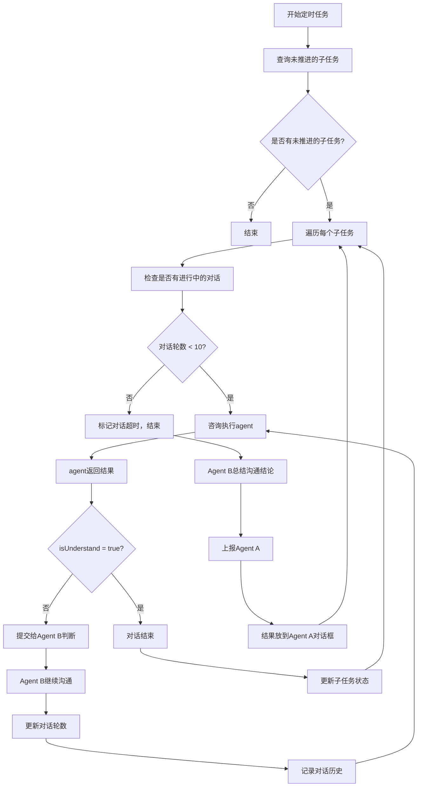
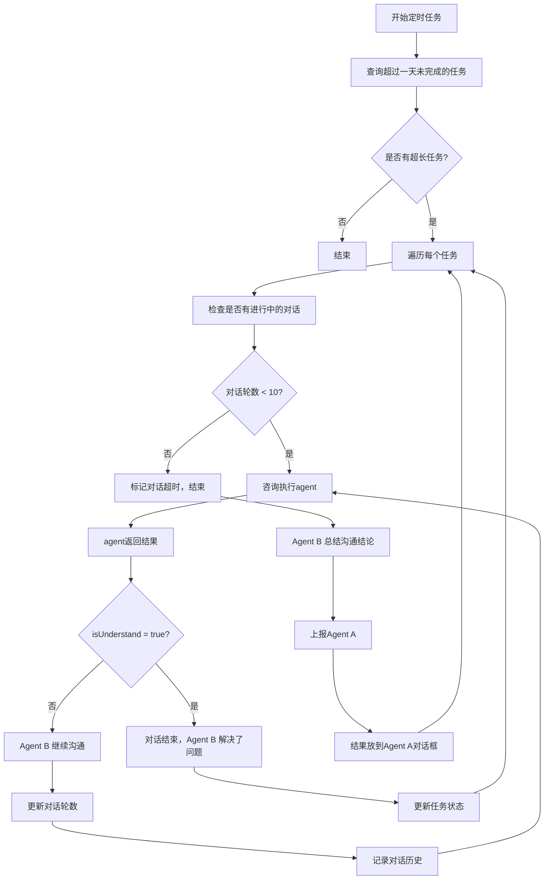
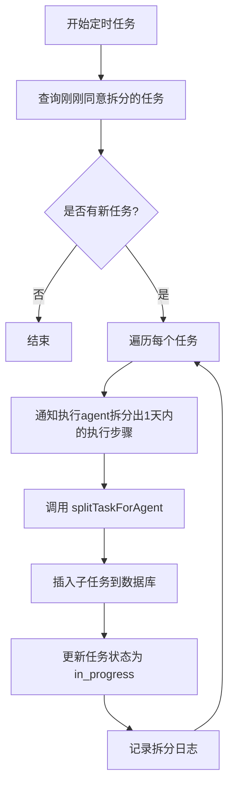
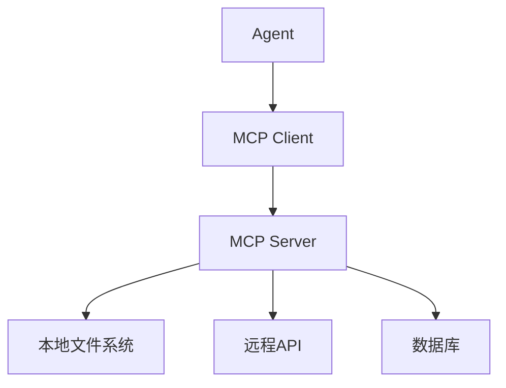

# 定时任务详细设计文档

## 概述

本文档详细设计了3个核心定时任务，涵盖子任务监控、每日巡检和任务拆分。

---

## 定时任务 1：check-subtask-progress（子任务执行推进监控）

### 基本信息
- **执行时间**：每 **10 分钟**
- **监控表**：`agent_sub_tasks`
- **监控条件**：
  - `status IN ('pending', 'in_progress')`
  - `createdAt > 30 分钟前`
  - `updatedAt < 10 分钟前`（最近10分钟内未更新，表示未推进）

### 业务流程



### 数据库表结构设计

#### 1. agent_sub_tasks 表（已存在，需新增字段）

| 字段 | 类型 | 说明 |
|------|------|------|
| id | number | 主键 |
| commandResultId | number | 关联的任务 ID |
| agentId | string | Agent ID |
| taskTitle | string | 子任务标题 |
| taskDescription | string | 子任务描述 |
| status | string | 子任务状态（pending, in_progress, completed, failed, skipped, blocked） |
| createdAt | Date | 创建时间 |
| startedAt | Date | 开始时间 |
| updatedAt | Date | 更新时间 |
| **dialogueSessionId** | string | 🆕 对话会话 ID（用于跟踪对话轮次） |
| **dialogueRounds** | number | 🆕 对话轮数 |
| **dialogueStatus** | string | 🆕 对话状态（none, in_progress, completed, timeout） |
| **lastDialogueAt** | Date | 🆕 最后对话时间 |

#### 2. agent_dialogues 表（新建）

| 字段 | 类型 | 说明 |
|------|------|------|
| id | number | 主键 |
| sessionId | string | 对话会话 ID |
| commandResultId | number | 关联的任务 ID |
| subTaskId | number | 关联的子任务 ID |
| sender | string | 发送者（system, agent_b, 执行agent） |
| receiver | string | 接收者 |
| message | string | 消息内容 |
| isUnderstand | boolean | 是否理解（true/false） |
| roundNumber | number | 轮次（1-10） |
| createdAt | Date | 创建时间 |

#### 3. agent_reports 表（新建）

| 字段 | 类型 | 说明 |
|------|------|------|
| id | number | 主键 |
| reportType | string | 报告类型（subtask_timeout, task_timeout） |
| commandResultId | number | 关联的任务 ID |
| subTaskId | number | 关联的子任务 ID（可选） |
| summary | string | 总结内容 |
| conclusion | string | 结论 |
| reportedTo | string | 上报对象（agent_a） |
| reportedFrom | string | 上报人（agent_b） |
| createdAt | Date | 创建时间 |

### API 设计

#### 1. 查询未推进的子任务

```
GET /api/cron/check-subtask-progress
```

**返回示例**：
```json
{
  "success": true,
  "monitoredCount": 3,
  "pendingDialogues": 1,
  "newDialogues": 2,
  "message": "监控了 3 个未推进的子任务，1 个进行中的对话，2 个新对话"
}
```

#### 2. 推进子任务执行

```
POST /api/subtasks/[id]/promote
```

**请求体**：
```json
{
  "sessionId": "对话会话ID"
}
```

**返回示例**：
```json
{
  "success": true,
  "roundNumber": 3,
  "isUnderstand": false,
  "agentResponse": "我需要更多关于XXX的信息",
  "message": "第 3 轮对话，agent 未理解"
}
```

#### 3. Agent B 判断

```
POST /api/agents/agent-b/judge
```

**请求体**：
```json
{
  "sessionId": "对话会话ID",
  "subTaskId": 123,
  "agentResponse": "执行agent的回复内容",
  "roundNumber": 3
}
```

**返回示例**：
```json
{
  "success": true,
  "shouldContinue": true,
  "nextQuestion": "请问你需要哪些具体的信息？",
  "isUnderstand": false,
  "message": "Agent B 判断需要继续沟通"
}
```

#### 4. 上报 Agent A

```
POST /api/reports/submit
```

**请求体**：
```json
{
  "reportType": "subtask_timeout",
  "commandResultId": 456,
  "subTaskId": 123,
  "summary": "子任务「XXX」执行遇到困难",
  "conclusion": "执行agent表示需要更多资源支持",
  "reportedFrom": "agent_b"
}
```

**返回示例**：
```json
{
  "success": true,
  "reportId": 789,
  "message": "报告已提交给 Agent A"
}
```

### 实现代码

```typescript
// src/app/api/cron/check-subtask-progress/route.ts

import { NextRequest, NextResponse } from 'next/server';
import { db } from '@/lib/db';
import { agentSubTasks, agentDialogues } from '@/lib/db/schema';
import { eq, and, sql, or, lt } from 'drizzle-orm';
import { generateSessionId } from '@/lib/session-id';

/**
 * GET /api/cron/check-subtask-progress
 * 10 分钟定时任务，监控未推进的子任务
 */
export async function GET(request: NextRequest) {
  console.log('🕐 10分钟定时任务 - 开始监控未推进的子任务...');

  try {
    const thirtyMinutesAgo = new Date(Date.now() - 30 * 60 * 1000);
    const tenMinutesAgo = new Date(Date.now() - 10 * 60 * 1000);

    // 1. 查询未推进的子任务
    const subTasks = await db
      .select()
      .from(agentSubTasks)
      .where(
        and(
          or(
            eq(agentSubTasks.status, 'pending'),
            eq(agentSubTasks.status, 'in_progress')
          ),
          sql`agent_sub_tasks.created_at < ${thirtyMinutesAgo.toISOString()}`,
          sql`agent_sub_tasks.updated_at < ${tenMinutesAgo.toISOString()}`,
          sql`agent_sub_tasks.dialogue_status != 'completed'`
        )
      );

    console.log(`📋 找到 ${subTasks.length} 个未推进的子任务`);

    let newDialogues = 0;
    let pendingDialogues = 0;

    // 2. 遍历每个子任务
    for (const subTask of subTasks) {
      console.log(`🔍 处理子任务 ${subTask.id}: ${subTask.taskTitle}`);

      // 3. 检查是否有进行中的对话
      if (subTask.dialogueSessionId && subTask.dialogueStatus === 'in_progress') {
        console.log(`💬 子任务 ${subTask.id} 有进行中的对话，继续推进`);
        pendingDialogues++;
        await continueDialogue(subTask);
      } else {
        console.log(`🆕 子任务 ${subTask.id} 无进行中的对话，创建新对话`);
        newDialogues++;
        await startNewDialogue(subTask);
      }
    }

    console.log(`✅ 定时任务完成：监控了 ${subTasks.length} 个子任务，${newDialogues} 个新对话，${pendingDialogues} 个进行中的对话`);

    return NextResponse.json({
      success: true,
      monitoredCount: subTasks.length,
      newDialogues,
      pendingDialogues,
      message: `监控了 ${subTasks.length} 个子任务，${newDialogues} 个新对话，${pendingDialogues} 个进行中的对话`,
    });
  } catch (error) {
    console.error('❌ 定时任务失败:', error);
    return NextResponse.json({
      success: false,
      error: error instanceof Error ? error.message : '未知错误',
      message: '定时任务执行失败',
    }, { status: 500 });
  }
}

/**
 * 开始新对话
 */
async function startNewDialogue(subTask: any) {
  // 1. 生成对话会话 ID
  const sessionId = generateSessionId('subtask_promotion', 'system', subTask.agentId);

  // 2. 更新子任务，标记对话开始
  await db.update(agentSubTasks)
    .set({
      dialogueSessionId: sessionId,
      dialogueRounds: 1,
      dialogueStatus: 'in_progress',
      lastDialogueAt: new Date(),
    })
    .where(eq(agentSubTasks.id, subTask.id));

  // 3. 插入第一条对话记录
  await db.insert(agentDialogues).values({
    sessionId,
    commandResultId: subTask.commandResultId,
    subTaskId: subTask.id,
    sender: 'system',
    receiver: subTask.agentId,
    message: `子任务「${subTask.taskTitle}」已创建超过 30 分钟，请问执行情况如何？遇到什么困难了吗？`,
    roundNumber: 1,
    createdAt: new Date(),
  });

  console.log(`🆕 已创建对话会话：${sessionId}，轮次：1`);
}

/**
 * 继续对话
 */
async function continueDialogue(subTask: any) {
  const sessionId = subTask.dialogueSessionId;
  const currentRound = subTask.dialogueRounds || 0;

  // 1. 检查是否超过 10 轮
  if (currentRound >= 10) {
    console.log(`⏰ 对话 ${sessionId} 已超过 10 轮，标记为超时`);
    await handleDialogueTimeout(subTask);
    return;
  }

  // 2. 查询上一条对话记录
  const lastDialogue = await db
    .select()
    .from(agentDialogues)
    .where(eq(agentDialogues.sessionId, sessionId))
    .orderBy(sql`${agentDialogues.createdAt} DESC`)
    .limit(1)
    .then(rows => rows[0]);

  if (!lastDialogue) {
    console.error(`❌ 对话 ${sessionId} 的上一条记录不存在`);
    return;
  }

  // 3. 检查上一条对话是否返回 isUnderstand = true
  if (lastDialogue.isUnderstand === true) {
    console.log(`✅ 对话 ${sessionId} 已结束，agent 已理解`);
    await endDialogue(subTask);
    return;
  }

  // 4. 提交给 Agent B 判断
  const agentBJudgment = await judgeByAgentB(lastDialogue);

  // 5. 插入 Agent B 的回复
  await db.insert(agentDialogues).values({
    sessionId,
    commandResultId: subTask.commandResultId,
    subTaskId: subTask.id,
    sender: 'agent_b',
    receiver: subTask.agentId,
    message: agentBJudgment.nextQuestion,
    isUnderstand: agentBJudgment.isUnderstand,
    roundNumber: currentRound + 1,
    createdAt: new Date(),
  });

  // 6. 更新子任务对话信息
  await db.update(agentSubTasks)
    .set({
      dialogueRounds: currentRound + 1,
      lastDialogueAt: new Date(),
    })
    .where(eq(agentSubTasks.id, subTask.id));

  console.log(`💬 对话 ${sessionId} 第 ${currentRound + 1} 轮完成`);
}

/**
 * Agent B 判断
 */
async function judgeByAgentB(lastDialogue: any) {
  // TODO: 调用 Agent B 的 LLM 能力进行判断
  // 这里先返回模拟数据

  return {
    shouldContinue: true,
    nextQuestion: '请问你需要哪些具体的信息？',
    isUnderstand: false,
  };
}

/**
 * 结束对话
 */
async function endDialogue(subTask: any) {
  // 1. 更新子任务对话状态
  await db.update(agentSubTasks)
    .set({
      dialogueStatus: 'completed',
    })
    .where(eq(agentSubTasks.id, subTask.id));

  console.log(`✅ 对话 ${subTask.dialogueSessionId} 已结束`);
}

/**
 * 处理对话超时
 */
async function handleDialogueTimeout(subTask: any) {
  // 1. 更新子任务对话状态
  await db.update(agentSubTasks)
    .set({
      dialogueStatus: 'timeout',
    })
    .where(eq(agentSubTasks.id, subTask.id));

  // 2. Agent B 总结沟通结论
  const summary = await summarizeDialogue(subTask);

  // 3. 上报 Agent A
  await reportToAgentA(subTask, summary);

  console.log(`⏰ 对话 ${subTask.dialogueSessionId} 超时，已上报 Agent A`);
}

/**
 * 总结对话
 */
async function summarizeDialogue(subTask: any) {
  // 1. 查询所有对话记录
  const dialogues = await db
    .select()
    .from(agentDialogues)
    .where(eq(agentDialogues.sessionId, subTask.dialogueSessionId))
    .orderBy(sql`${agentDialogues.createdAt} ASC`);

  // 2. 调用 Agent B 总结
  // TODO: 调用 Agent B 的 LLM 能力进行总结

  return {
    summary: `子任务「${subTask.taskTitle}」执行遇到困难，经过 ${dialogues.length} 轮沟通仍未解决`,
    conclusion: '需要 Agent A 介入协调资源支持',
  };
}

/**
 * 上报 Agent A
 */
async function reportToAgentA(subTask: any, summary: any) {
  // 1. 插入报告记录
  await db.insert(agentReports).values({
    reportType: 'subtask_timeout',
    commandResultId: subTask.commandResultId,
    subTaskId: subTask.id,
    summary: summary.summary,
    conclusion: summary.conclusion,
    reportedTo: 'agent_a',
    reportedFrom: 'agent_b',
    createdAt: new Date(),
  });

  // 2. 创建对话记录（放到 Agent A 对话框中）
  await db.insert(agentDialogues).values({
    sessionId: generateSessionId('report', 'agent_b', 'agent_a'),
    commandResultId: subTask.commandResultId,
    subTaskId: subTask.id,
    sender: 'agent_b',
    receiver: 'agent_a',
    message: `[子任务超时报告] ${summary.summary}\n\n结论：${summary.conclusion}`,
    roundNumber: 1,
    createdAt: new Date(),
  });

  console.log(`📤 已上报 Agent A`);
}
```

---

## 定时任务 2：check-long-running-tasks（每日13:00任务巡检）

### 基本信息
- **执行时间**：每日 **13:00**
- **监控表**：`command_results`
- **监控条件**：
  - `executionStatus = 'in_progress'`
  - `createdAt > 1 天前`

### 业务流程



### API 设计

#### 1. 查询超长任务

```
GET /api/cron/check-long-running-tasks
```

**返回示例**：
```json
{
  "success": true,
  "monitoredCount": 2,
  "pendingDialogues": 1,
  "newDialogues": 1,
  "message": "监控了 2 个超长任务"
}
```

#### 2. Agent B 总结（超长任务版本）

```
POST /api/agents/agent-b/summarize-long-task
```

**请求体**：
```json
{
  "sessionId": "对话会话ID",
  "commandResultId": 456,
  "dialogueHistory": [...]
}
```

**返回示例**：
```json
{
  "success": true,
  "summary": "任务执行过程中遇到XXX困难",
  "conclusion": "需要Agent A 协调资源",
  "reportMessage": "任务「XXX」执行超过1天，经过多轮沟通仍未完成...",
  "message": "总结完成"
}
```

### 实现代码

```typescript
// src/app/api/cron/check-long-running-tasks/route.ts

import { NextRequest, NextResponse } from 'next/server';
import { db } from '@/lib/db';
import { commandResults, agentDialogues, agentReports } from '@/lib/db/schema';
import { eq, and, sql, lt } from 'drizzle-orm';
import { generateSessionId } from '@/lib/session-id';

/**
 * GET /api/cron/check-long-running-tasks
 * 每日 13:00 定时任务，监控超过一天未完成的任务
 */
export async function GET(request: NextRequest) {
  console.log('🕐 每日13:00定时任务 - 开始监控超长任务...');

  try {
    const oneDayAgo = new Date(Date.now() - 24 * 60 * 60 * 1000);

    // 1. 查询超过一天未完成的任务
    const tasks = await db
      .select()
      .from(commandResults)
      .where(
        and(
          eq(commandResults.executionStatus, 'in_progress'),
          sql`command_results.created_at < ${oneDayAgo.toISOString()}`,
          sql`command_results.dialogue_status != 'completed'`
        )
      );

    console.log(`📋 找到 ${tasks.length} 个超长任务`);

    let newDialogues = 0;
    let pendingDialogues = 0;

    // 2. 遍历每个任务
    for (const task of tasks) {
      console.log(`🔍 处理任务 ${task.id}: ${task.taskName || task.commandContent?.substring(0, 50)}`);

      // 3. 检查是否有进行中的对话
      if (task.dialogueSessionId && task.dialogueStatus === 'in_progress') {
        console.log(`💬 任务 ${task.id} 有进行中的对话，继续推进`);
        pendingDialogues++;
        await continueTaskDialogue(task);
      } else {
        console.log(`🆕 任务 ${task.id} 无进行中的对话，创建新对话`);
        newDialogues++;
        await startNewTaskDialogue(task);
      }
    }

    console.log(`✅ 定时任务完成：监控了 ${tasks.length} 个超长任务，${newDialogues} 个新对话，${pendingDialogues} 个进行中的对话`);

    return NextResponse.json({
      success: true,
      monitoredCount: tasks.length,
      newDialogues,
      pendingDialogues,
      message: `监控了 ${tasks.length} 个超长任务，${newDialogues} 个新对话，${pendingDialogues} 个进行中的对话`,
    });
  } catch (error) {
    console.error('❌ 定时任务失败:', error);
    return NextResponse.json({
      success: false,
      error: error instanceof Error ? error.message : '未知错误',
      message: '定时任务执行失败',
    }, { status: 500 });
  }
}

/**
 * 开始新对话
 */
async function startNewTaskDialogue(task: any) {
  // 1. 生成对话会话 ID
  const sessionId = generateSessionId('long_task_inspection', 'agent_b', task.executor);

  // 2. 更新任务，标记对话开始
  await db.update(commandResults)
    .set({
      dialogueSessionId: sessionId,
      dialogueRounds: 1,
      dialogueStatus: 'in_progress',
      lastDialogueAt: new Date(),
    })
    .where(eq(commandResults.id, task.id));

  // 3. 插入第一条对话记录
  await db.insert(agentDialogues).values({
    sessionId,
    commandResultId: task.id,
    sender: 'agent_b',
    receiver: task.executor,
    message: `任务「${task.taskName || task.commandContent?.substring(0, 50)}」已执行超过 1 天，请问遇到什么困难？需要帮助吗？`,
    roundNumber: 1,
    createdAt: new Date(),
  });

  console.log(`🆕 已创建对话会话：${sessionId}，轮次：1`);
}

/**
 * 继续对话
 */
async function continueTaskDialogue(task: any) {
  const sessionId = task.dialogueSessionId;
  const currentRound = task.dialogueRounds || 0;

  // 1. 检查是否超过 10 轮
  if (currentRound >= 10) {
    console.log(`⏰ 对话 ${sessionId} 已超过 10 轮，标记为超时`);
    await handleTaskDialogueTimeout(task);
    return;
  }

  // 2. 查询上一条对话记录
  const lastDialogue = await db
    .select()
    .from(agentDialogues)
    .where(eq(agentDialogues.sessionId, sessionId))
    .orderBy(sql`${agentDialogues.createdAt} DESC`)
    .limit(1)
    .then(rows => rows[0]);

  if (!lastDialogue) {
    console.error(`❌ 对话 ${sessionId} 的上一条记录不存在`);
    return;
  }

  // 3. 检查上一条对话是否返回 isUnderstand = true
  if (lastDialogue.isUnderstand === true) {
    console.log(`✅ 对话 ${sessionId} 已结束，Agent B 解决了问题`);
    await endTaskDialogue(task);
    return;
  }

  // 4. Agent B 继续沟通
  const agentBResponse = await agentBContinueDialogue(task, lastDialogue);

  // 5. 插入 Agent B 的回复
  await db.insert(agentDialogues).values({
    sessionId,
    commandResultId: task.id,
    sender: 'agent_b',
    receiver: task.executor,
    message: agentBResponse.message,
    isUnderstand: agentBResponse.isUnderstand,
    roundNumber: currentRound + 1,
    createdAt: new Date(),
  });

  // 6. 更新任务对话信息
  await db.update(commandResults)
    .set({
      dialogueRounds: currentRound + 1,
      lastDialogueAt: new Date(),
    })
    .where(eq(commandResults.id, task.id));

  console.log(`💬 对话 ${sessionId} 第 ${currentRound + 1} 轮完成`);
}

/**
 * Agent B 继续沟通
 */
async function agentBContinueDialogue(task: any, lastDialogue: any) {
  // TODO: 调用 Agent B 的 LLM 能力进行沟通
  // 这里先返回模拟数据

  return {
    message: '请问你需要哪些具体的信息？或者需要我提供哪些帮助？',
    isUnderstand: false,
  };
}

/**
 * 结束对话
 */
async function endTaskDialogue(task: any) {
  // 1. 更新任务对话状态
  await db.update(commandResults)
    .set({
      dialogueStatus: 'completed',
    })
    .where(eq(commandResults.id, task.id));

  console.log(`✅ 对话 ${task.dialogueSessionId} 已结束，Agent B 解决了问题`);
}

/**
 * 处理对话超时
 */
async function handleTaskDialogueTimeout(task: any) {
  // 1. 更新任务对话状态
  await db.update(commandResults)
    .set({
      dialogueStatus: 'timeout',
    })
    .where(eq(commandResults.id, task.id));

  // 2. Agent B 总结沟通结论
  const summary = await summarizeTaskDialogue(task);

  // 3. 上报 Agent A
  await reportToAgentAForTask(task, summary);

  console.log(`⏰ 对话 ${task.dialogueSessionId} 超时，已上报 Agent A`);
}

/**
 * 总结对话
 */
async function summarizeTaskDialogue(task: any) {
  // 1. 查询所有对话记录
  const dialogues = await db
    .select()
    .from(agentDialogues)
    .where(eq(agentDialogues.sessionId, task.dialogueSessionId))
    .orderBy(sql`${agentDialogues.createdAt} ASC`);

  // 2. 调用 Agent B 总结
  // TODO: 调用 Agent B 的 LLM 能力进行总结

  return {
    summary: `任务「${task.taskName || task.commandContent?.substring(0, 50)}」执行超过 1 天，经过 ${dialogues.length} 轮沟通仍未完成`,
    conclusion: '需要 Agent A 介入协调资源支持',
    reportMessage: `任务「${task.taskName || task.commandContent?.substring(0, 50)}」执行超过 1 天，经过 ${dialogues.length} 轮沟通仍未完成。执行agent表示：需要更多资源支持。`,
  };
}

/**
 * 上报 Agent A
 */
async function reportToAgentAForTask(task: any, summary: any) {
  // 1. 插入报告记录
  await db.insert(agentReports).values({
    reportType: 'task_timeout',
    commandResultId: task.id,
    summary: summary.summary,
    conclusion: summary.conclusion,
    reportedTo: 'agent_a',
    reportedFrom: 'agent_b',
    createdAt: new Date(),
  });

  // 2. 创建对话记录（放到 Agent A 对话框中）
  await db.insert(agentDialogues).values({
    sessionId: generateSessionId('report', 'agent_b', 'agent_a'),
    commandResultId: task.id,
    sender: 'agent_b',
    receiver: 'agent_a',
    message: `[任务超时报告] ${summary.reportMessage}\n\n结论：${summary.conclusion}`,
    roundNumber: 1,
    createdAt: new Date(),
  });

  console.log(`📤 已上报 Agent A`);
}
```

---

## 定时任务 3：check-new-tasks-to-split（新任务拆分）

### 基本信息
- **执行时间**：每 **10 分钟**
- **监控表**：`command_results`
- **监控条件**：
  - `executionStatus = 'new'`（刚刚同意拆分的任务）
  - `questionStatus = 'resolved'`（无疑问）

### 业务流程



### API 设计

#### 1. 查询需要拆分的任务

```
GET /api/cron/check-new-tasks-to-split
```

**返回示例**：
```json
{
  "success": true,
  "monitoredCount": 2,
  "splitCount": 2,
  "message": "监控了 2 个新任务，成功拆分 2 个"
}
```

### 实现代码

```typescript
// src/app/api/cron/check-new-tasks-to-split/route.ts

import { NextRequest, NextResponse } from 'next/server';
import { db } from '@/lib/db';
import { commandResults, agentSubTasks, agentInteractions } from '@/lib/db/schema';
import { eq, and, sql } from 'drizzle-orm';
import { splitTaskForAgent } from '@/lib/agent-llm';
import { generateSessionId } from '@/lib/session-id';

/**
 * GET /api/cron/check-new-tasks-to-split
 * 10 分钟定时任务，监控刚刚同意拆分的任务
 */
export async function GET(request: NextRequest) {
  console.log('🕐 10分钟定时任务 - 开始监控新任务拆分...');

  try {
    // 1. 查询刚刚同意拆分的任务
    const tasks = await db
      .select()
      .from(commandResults)
      .where(
        and(
          eq(commandResults.executionStatus, 'new'),
          eq(commandResults.questionStatus, 'resolved'),
          sql`command_results.sub_task_count IS NULL OR command_results.sub_task_count = 0`
        )
      );

    console.log(`📋 找到 ${tasks.length} 个需要拆分的新任务`);

    let splitCount = 0;

    // 2. 遍历每个任务
    for (const task of tasks) {
      console.log(`🔍 处理任务 ${task.id}: ${task.taskName || task.commandContent?.substring(0, 50)}`);

      // 3. 通知执行 agent 拆分出 1 天内的执行步骤
      const subTasks = await splitTaskForAgent(task.executor, task);

      console.log(`✅ Agent ${task.executor} 拆分完成，子任务数量：${subTasks.length}`);

      // 4. 插入子任务到数据库
      for (let i = 0; i < subTasks.length; i++) {
        await db.insert(agentSubTasks).values({
          commandResultId: task.id,
          agentId: task.executor,
          taskTitle: subTasks[i].title,
          taskDescription: subTasks[i].description,
          status: 'pending',
          orderIndex: subTasks[i].orderIndex,
          metadata: {
            acceptanceCriteria: subTasks[i].acceptanceCriteria,
            isCritical: subTasks[i].isCritical || false,
            criticalReason: subTasks[i].criticalReason || '',
          },
        });
      }

      // 5. 更新任务状态为 in_progress
      await db.update(commandResults)
        .set({
          executionStatus: 'in_progress',
          subTaskCount: subTasks.length,
          completedSubTasks: 0,
          completedSubTasksDescription: '',
          updatedAt: new Date(),
        })
        .where(eq(commandResults.id, task.id));

      // 6. 记录拆分日志
      await db.insert(agentInteractions).values({
        commandResultId: task.id,
        taskDescription: task.taskName || task.commandContent?.substring(0, 100),
        sessionId: generateSessionId('task_split', 'system', task.executor),
        sender: 'system',
        receiver: task.executor,
        messageType: 'notification',
        content: `已拆分任务为 ${subTasks.length} 个子任务（1天内的执行步骤）`,
        roundNumber: 1,
        metadata: {
          action: 'auto_split_task',
          subTaskCount: subTasks.length,
          trigger: 'cron_check_new_tasks_to_split',
        },
      });

      splitCount++;
      console.log(`✅ 任务 ${task.id} 拆分完成`);
    }

    console.log(`✅ 定时任务完成：监控了 ${tasks.length} 个新任务，成功拆分 ${splitCount} 个`);

    return NextResponse.json({
      success: true,
      monitoredCount: tasks.length,
      splitCount,
      message: `监控了 ${tasks.length} 个新任务，成功拆分 ${splitCount} 个`,
    });
  } catch (error) {
    console.error('❌ 定时任务失败:', error);
    return NextResponse.json({
      success: false,
      error: error instanceof Error ? error.message : '未知错误',
      message: '定时任务执行失败',
    }, { status: 500 });
  }
}
```

---

## Agent B 判断和 Agent A 上报机制

### Agent B 判断流程

```typescript
// src/lib/agents/agent-b-judgment.ts

export interface AgentBJudgment {
  shouldContinue: boolean;
  nextQuestion?: string;
  isUnderstand: boolean;
  summary?: string;
}

/**
 * Agent B 判断执行agent的回复
 */
export async function judgeExecutorResponse(
  executorResponse: string,
  dialogueHistory: any[],
  context: any
): Promise<AgentBJudgment> {
  // 1. 调用 LLM 让 Agent B 判断
  const prompt = `
你是一个任务协调助手（Agent B），负责与执行agent沟通，了解任务执行情况。

背景信息：
- 任务名称：${context.taskName}
- 子任务名称：${context.subTaskName || '无'}
- 当前轮次：${dialogueHistory.length + 1} / 10

对话历史：
${dialogueHistory.map((d, i) => `[${i + 1}] ${d.sender}: ${d.message}`).join('\n')}

执行agent的最新回复：
${executorResponse}

请判断：
1. 执行agent是否理解了问题并给出明确答复？（isUnderstand）
2. 是否需要继续沟通？（shouldContinue）
3. 如果需要继续，下一个问题是什么？（nextQuestion）

返回JSON格式：
{
  "isUnderstand": true/false,
  "shouldContinue": true/false,
  "nextQuestion": "下一个问题（如果需要继续）"
}
`;

  const response = await callLLM(prompt);

  // 2. 解析响应
  return JSON.parse(response);
}
```

### Agent A 上报机制

```typescript
// src/lib/reports/agent-a-reporter.ts

/**
 * 上报给 Agent A
 */
export async function reportToAgentA(report: {
  reportType: string;
  commandResultId: number;
  subTaskId?: number;
  summary: string;
  conclusion: string;
  reportedFrom: string;
}) {
  // 1. 插入报告记录
  const reportRecord = await db.insert(agentReports).values({
    ...report,
    reportedTo: 'agent_a',
    createdAt: new Date(),
  });

  // 2. 创建对话记录（放到 Agent A 对话框中）
  await db.insert(agentDialogues).values({
    sessionId: generateSessionId('report', report.reportedFrom, 'agent_a'),
    commandResultId: report.commandResultId,
    subTaskId: report.subTaskId,
    sender: report.reportedFrom,
    receiver: 'agent_a',
    message: `[${getReportTypeLabel(report.reportType)}] ${report.summary}\n\n结论：${report.conclusion}`,
    roundNumber: 1,
    createdAt: new Date(),
  });

  // 3. 通知 Agent A
  await notifyAgentA(report);

  console.log(`📤 已上报 Agent A`);
}

/**
 * 获取报告类型标签
 */
function getReportTypeLabel(reportType: string): string {
  const labels = {
    subtask_timeout: '子任务超时报告',
    task_timeout: '任务超时报告',
  };
  return labels[reportType] || '报告';
}

/**
 * 通知 Agent A
 */
async function notifyAgentA(report: any) {
  // TODO: 实现 Agent A 通知机制
  console.log(`🔔 已通知 Agent A 查看 ${report.reportType}`);
}
```

---

## 数据库表结构更新

### commandResults 表（需新增字段）

| 字段 | 类型 | 说明 |
|------|------|------|
| id | number | 主键 |
| ... | ... | ...（原有字段） |
| **dialogueSessionId** | string | 🆕 对话会话 ID |
| **dialogueRounds** | number | 🆕 对话轮数 |
| **dialogueStatus** | string | 🆕 对话状态（none, in_progress, completed, timeout） |
| **lastDialogueAt** | Date | 🆕 最后对话时间 |

### agentSubTasks 表（需新增字段）

| 字段 | 类型 | 说明 |
|------|------|------|
| id | number | 主键 |
| ... | ... | ...（原有字段） |
| **dialogueSessionId** | string | 🆕 对话会话 ID |
| **dialogueRounds** | number | 🆕 对话轮数 |
| **dialogueStatus** | string | 🆕 对话状态（none, in_progress, completed, timeout） |
| **lastDialogueAt** | Date | 🆕 最后对话时间 |

### agentDialogues 表（新建）

| 字段 | 类型 | 说明 |
|------|------|------|
| id | number | 主键 |
| sessionId | string | 对话会话 ID |
| commandResultId | number | 关联的任务 ID |
| subTaskId | number | 关联的子任务 ID（可选） |
| sender | string | 发送者（system, agent_b, 执行agent, agent_a） |
| receiver | string | 接收者 |
| message | string | 消息内容 |
| isUnderstand | boolean | 是否理解（true/false） |
| roundNumber | number | 轮次（1-10） |
| createdAt | Date | 创建时间 |

### agentReports 表（新建）

| 字段 | 类型 | 说明 |
|------|------|------|
| id | number | 主键 |
| reportType | string | 报告类型（subtask_timeout, task_timeout） |
| commandResultId | number | 关联的任务 ID |
| subTaskId | number | 关联的子任务 ID（可选） |
| summary | string | 总结内容 |
| conclusion | string | 结论 |
| reportedTo | string | 上报对象（agent_a） |
| reportedFrom | string | 上报人（agent_b） |
| createdAt | Date | 创建时间 |

---

## MCP 集成方案

### 概述

MCP（Model Context Protocol）是一个标准协议，允许 AI 模型与外部工具和服务进行交互。Agent 可以通过 MCP 获取本地文件和查询远程数据。

### MCP 架构



### 本地文件访问

#### MCP Server 配置

```typescript
// src/lib/mcp/server.ts

import { MCPServer } from '@modelcontextprotocol/sdk/server';
import { StdioServerTransport } from '@modelcontextprotocol/sdk/server/stdio';
import {
  CallToolRequestSchema,
  ListToolsRequestSchema,
} from '@modelcontextprotocol/sdk/types';

// 创建 MCP Server
const server = new MCPServer(
  {
    name: 'file-system-server',
    version: '1.0.0',
  },
  {
    capabilities: {
      tools: {},
    },
  }
);

// 注册文件系统工具
server.setRequestHandler(ListToolsRequestSchema, async () => {
  return {
    tools: [
      {
        name: 'read_file',
        description: '读取本地文件内容',
        inputSchema: {
          type: 'object',
          properties: {
            path: {
              type: 'string',
              description: '文件路径',
            },
          },
          required: ['path'],
        },
      },
      {
        name: 'write_file',
        description: '写入内容到本地文件',
        inputSchema: {
          type: 'object',
          properties: {
            path: {
              type: 'string',
              description: '文件路径',
            },
            content: {
              type: 'string',
              description: '文件内容',
            },
          },
          required: ['path', 'content'],
        },
      },
      {
        name: 'list_files',
        description: '列出目录中的文件',
        inputSchema: {
          type: 'object',
          properties: {
            path: {
              type: 'string',
              description: '目录路径',
            },
            recursive: {
              type: 'boolean',
              description: '是否递归列出子目录',
              default: false,
            },
          },
          required: ['path'],
        },
      },
    ],
  };
});

// 处理工具调用
server.setRequestHandler(CallToolRequestSchema, async (request) => {
  const { name, arguments: args } = request.params;

  switch (name) {
    case 'read_file':
      return readFile(args.path);
    case 'write_file':
      return writeFile(args.path, args.content);
    case 'list_files':
      return listFiles(args.path, args.recursive);
    default:
      throw new Error(`Unknown tool: ${name}`);
  }
});

// 启动 MCP Server
async function startMCPServer() {
  const transport = new StdioServerTransport();
  await server.connect(transport);
  console.log('MCP Server 已启动');
}

/**
 * 读取文件
 */
async function readFile(path: string) {
  // 安全检查：限制可访问的目录
  const allowedDirectories = [
    '/workspace/projects',
    '/tmp',
  ];

  const resolvedPath = resolvePath(path, allowedDirectories);
  if (!resolvedPath) {
    throw new Error(`访问被拒绝：${path}`);
  }

  const content = await fs.readFile(resolvedPath, 'utf-8');
  return {
    content: [
      {
        type: 'text',
        text: content,
      },
    ],
  };
}

/**
 * 写入文件
 */
async function writeFile(path: string, content: string) {
  // 安全检查
  const allowedDirectories = [
    '/workspace/projects',
    '/tmp',
  ];

  const resolvedPath = resolvePath(path, allowedDirectories);
  if (!resolvedPath) {
    throw new Error(`访问被拒绝：${path}`);
  }

  await fs.writeFile(resolvedPath, content, 'utf-8');
  return {
    content: [
      {
        type: 'text',
        text: `文件已写入：${resolvedPath}`,
      },
    ],
  };
}

/**
 * 列出文件
 */
async function listFiles(path: string, recursive: boolean = false) {
  const allowedDirectories = [
    '/workspace/projects',
    '/tmp',
  ];

  const resolvedPath = resolvePath(path, allowedDirectories);
  if (!resolvedPath) {
    throw new Error(`访问被拒绝：${path}`);
  }

  const files = await listDirectory(resolvedPath, recursive);
  return {
    content: [
      {
        type: 'text',
        text: JSON.stringify(files, null, 2),
      },
    ],
  };
}

/**
 * 解析路径（安全检查）
 */
function resolvePath(path: string, allowedDirectories: string[]): string | null {
  const absolutePath = require('path').resolve(path);

  for (const dir of allowedDirectories) {
    const allowedDir = require('path').resolve(dir);
    if (absolutePath.startsWith(allowedDir)) {
      return absolutePath;
    }
  }

  return null;
}

/**
 * 列出目录
 */
async function listDirectory(path: string, recursive: boolean): Promise<string[]> {
  const files: string[] = [];
  const entries = await fs.readdir(path, { withFileTypes: true });

  for (const entry of entries) {
    const fullPath = require('path').join(path, entry.name);
    files.push(fullPath);

    if (entry.isDirectory() && recursive) {
      const subFiles = await listDirectory(fullPath, recursive);
      files.push(...subFiles);
    }
  }

  return files;
}

export { startMCPServer };
```

### Agent 使用 MCP

```typescript
// src/lib/agents/mcp-client.ts

import { MCPClient } from '@modelcontextprotocol/sdk/client';

/**
 * MCP 客户端
 */
export class MCPAgentClient {
  private client: MCPClient;

  constructor() {
    this.client = new MCPClient();
  }

  /**
   * 连接 MCP Server
   */
  async connect() {
    await this.client.connect({
      command: 'node',
      args: ['/workspace/projects/src/lib/mcp/server.js'],
    });
  }

  /**
   * 读取文件
   */
  async readFile(path: string): Promise<string> {
    const result = await this.client.callTool({
      name: 'read_file',
      arguments: { path },
    });

    return result.content[0].text;
  }

  /**
   * 写入文件
   */
  async writeFile(path: string, content: string): Promise<void> {
    await this.client.callTool({
      name: 'write_file',
      arguments: { path, content },
    });
  }

  /**
   * 列出文件
   */
  async listFiles(path: string, recursive: boolean = false): Promise<string[]> {
    const result = await this.client.callTool({
      name: 'list_files',
      arguments: { path, recursive },
    });

    return JSON.parse(result.content[0].text);
  }
}

/**
 * Agent 使用 MCP 读取本地文件
 */
export async function agentReadLocalFile(
  agentId: string,
  filePath: string
): Promise<string> {
  console.log(`Agent ${agentId} 正在读取本地文件：${filePath}`);

  const mcpClient = new MCPAgentClient();
  await mcpClient.connect();

  const content = await mcpClient.readFile(filePath);

  console.log(`Agent ${agentId} 成功读取文件：${filePath}`);

  return content;
}

/**
 * Agent 使用 MCP 写入本地文件
 */
export async function agentWriteLocalFile(
  agentId: string,
  filePath: string,
  content: string
): Promise<void> {
  console.log(`Agent ${agentId} 正在写入本地文件：${filePath}`);

  const mcpClient = new MCPAgentClient();
  await mcpClient.connect();

  await mcpClient.writeFile(filePath, content);

  console.log(`Agent ${agentId} 成功写入文件：${filePath}`);
}
```

### 远程数据查询

#### MCP Server 扩展（远程 API）

```typescript
// src/lib/mcp/server.ts

// 注册远程 API 工具
server.setRequestHandler(ListToolsRequestSchema, async () => {
  return {
    tools: [
      // ... 文件系统工具 ...

      {
        name: 'fetch_remote_data',
        description: '查询远程 API 数据',
        inputSchema: {
          type: 'object',
          properties: {
            url: {
              type: 'string',
              description: '远程 API URL',
            },
            method: {
              type: 'string',
              description: 'HTTP 方法（GET, POST, PUT, DELETE）',
              default: 'GET',
            },
            headers: {
              type: 'object',
              description: 'HTTP 请求头',
            },
            body: {
              type: 'object',
              description: '请求体（用于 POST/PUT）',
            },
          },
          required: ['url'],
        },
      },
      {
        name: 'query_database',
        description: '查询数据库',
        inputSchema: {
          type: 'object',
          properties: {
            table: {
              type: 'string',
              description: '表名',
            },
            where: {
              type: 'object',
              description: '查询条件',
            },
            limit: {
              type: 'number',
              description: '返回数量限制',
              default: 10,
            },
          },
          required: ['table'],
        },
      },
    ],
  };
});

// 处理工具调用
server.setRequestHandler(CallToolRequestSchema, async (request) => {
  const { name, arguments: args } = request.params;

  switch (name) {
    // ... 文件系统工具 ...
    case 'fetch_remote_data':
      return fetchRemoteData(args);
    case 'query_database':
      return queryDatabase(args);
    default:
      throw new Error(`Unknown tool: ${name}`);
  }
});

/**
 * 查询远程数据
 */
async function fetchRemoteData(args: any) {
  const { url, method = 'GET', headers = {}, body } = args;

  // 安全检查：限制可访问的域名
  const allowedDomains = [
    'api.example.com',
    'data.example.com',
  ];

  const urlObj = new URL(url);
  if (!allowedDomains.includes(urlObj.hostname)) {
    throw new Error(`访问被拒绝：${url}`);
  }

  const response = await fetch(url, {
    method,
    headers,
    body: body ? JSON.stringify(body) : undefined,
  });

  const data = await response.json();

  return {
    content: [
      {
        type: 'text',
        text: JSON.stringify(data, null, 2),
      },
    ],
  };
}

/**
 * 查询数据库
 */
async function queryDatabase(args: any) {
  const { table, where = {}, limit = 10 } = args;

  // 安全检查：限制可查询的表
  const allowedTables = [
    'tasks',
    'subtasks',
    'agents',
  ];

  if (!allowedTables.includes(table)) {
    throw new Error(`查询被拒绝：${table}`);
  }

  // 查询数据库
  const results = await db
    .select()
    .from(db[table])
    .limit(limit);

  return {
    content: [
      {
        type: 'text',
        text: JSON.stringify(results, null, 2),
      },
    ],
  };
}
```

### Agent 使用 MCP 查询远程数据

```typescript
// src/lib/agents/mcp-client.ts

/**
 * Agent 使用 MCP 查询远程数据
 */
export async function agentQueryRemoteData(
  agentId: string,
  url: string,
  method: string = 'GET',
  headers: Record<string, string> = {},
  body?: any
): Promise<any> {
  console.log(`Agent ${agentId} 正在查询远程数据：${url}`);

  const mcpClient = new MCPAgentClient();
  await mcpClient.connect();

  const result = await mcpClient.callTool({
    name: 'fetch_remote_data',
    arguments: { url, method, headers, body },
  });

  const data = JSON.parse(result.content[0].text);

  console.log(`Agent ${agentId} 成功查询远程数据：${url}`);

  return data;
}

/**
 * Agent 使用 MCP 查询数据库
 */
export async function agentQueryDatabase(
  agentId: string,
  table: string,
  where: Record<string, any> = {},
  limit: number = 10
): Promise<any[]> {
  console.log(`Agent ${agentId} 正在查询数据库表：${table}`);

  const mcpClient = new MCPAgentClient();
  await mcpClient.connect();

  const result = await mcpClient.callTool({
    name: 'query_database',
    arguments: { table, where, limit },
  });

  const data = JSON.parse(result.content[0].text);

  console.log(`Agent ${agentId} 成功查询数据库表：${table}，返回 ${data.length} 条记录`);

  return data;
}
```

### MCP 安全机制

1. **路径安全检查**：限制可访问的目录和文件
2. **域名白名单**：限制可访问的远程 API 域名
3. **表白名单**：限制可查询的数据库表
4. **权限控制**：根据 Agent ID 限制访问权限
5. **审计日志**：记录所有 MCP 调用

```typescript
// src/lib/mcp/security.ts

export interface MCPAccessPolicy {
  agentId: string;
  allowedDirectories: string[];
  allowedDomains: string[];
  allowedTables: string[];
  maxFileSize: number;
}

/**
 * 检查访问权限
 */
export function checkAccessPermission(
  agentId: string,
  operation: string,
  target: string
): boolean {
  const policy = getAccessPolicy(agentId);

  switch (operation) {
    case 'read_file':
    case 'write_file':
      return policy.allowedDirectories.some(dir => target.startsWith(dir));
    case 'fetch_remote_data':
      const url = new URL(target);
      return policy.allowedDomains.includes(url.hostname);
    case 'query_database':
      return policy.allowedTables.includes(target);
    default:
      return false;
  }
}

/**
 * 获取访问策略
 */
function getAccessPolicy(agentId: string): MCPAccessPolicy {
  // TODO: 从数据库或配置文件读取访问策略
  return {
    agentId,
    allowedDirectories: ['/workspace/projects', '/tmp'],
    allowedDomains: ['api.example.com'],
    allowedTables: ['tasks', 'subtasks', 'agents'],
    maxFileSize: 10 * 1024 * 1024, // 10 MB
  };
}

/**
 * 记录审计日志
 */
export async function logMCPAccess(
  agentId: string,
  operation: string,
  target: string,
  success: boolean
) {
  // TODO: 写入审计日志
  console.log(`[MCP审计] ${agentId} - ${operation} - ${target} - ${success ? '成功' : '失败'}`);
}
```

---

## 总结

### 定时任务汇总

| 定时任务 | 执行时间 | 监控表 | 监控条件 | 业务职责 |
|---------|---------|-------|---------|---------|
| check-subtask-progress | 每10分钟 | agent_sub_tasks | status IN ('pending', 'in_progress') AND createdAt > 30分钟 AND updatedAt < 10分钟 | 监控子任务执行推进，咨询执行agent，Agent B判断，最多10轮对话 |
| check-long-running-tasks | 每日13:00 | command_results | executionStatus = 'in_progress' AND createdAt > 1天 | 巡检超长任务，咨询执行agent，Agent B判断，最多10轮对话 |
| check-new-tasks-to-split | 每10分钟 | command_results | executionStatus = 'new' AND questionStatus = 'resolved' AND subTaskCount IS NULL | 通知执行agent拆分出1天内的执行步骤 |

### 数据库表变更

1. **commandResults 表**：新增对话相关字段（dialogueSessionId、dialogueRounds、dialogueStatus、lastDialogueAt）
2. **agentSubTasks 表**：新增对话相关字段（dialogueSessionId、dialogueRounds、dialogueStatus、lastDialogueAt）
3. **agentDialogues 表**：新建表，存储对话记录
4. **agentReports 表**：新建表，存储上报给 Agent A 的报告

### MCP 集成

1. **MCP Server**：提供文件系统、远程 API、数据库查询能力
2. **MCP Client**：Agent 通过 MCP Client 调用 MCP Server 提供的工具
3. **安全机制**：路径检查、域名白名单、表白名单、权限控制、审计日志
