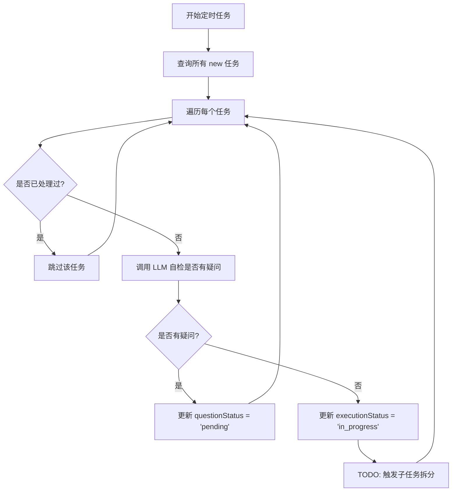
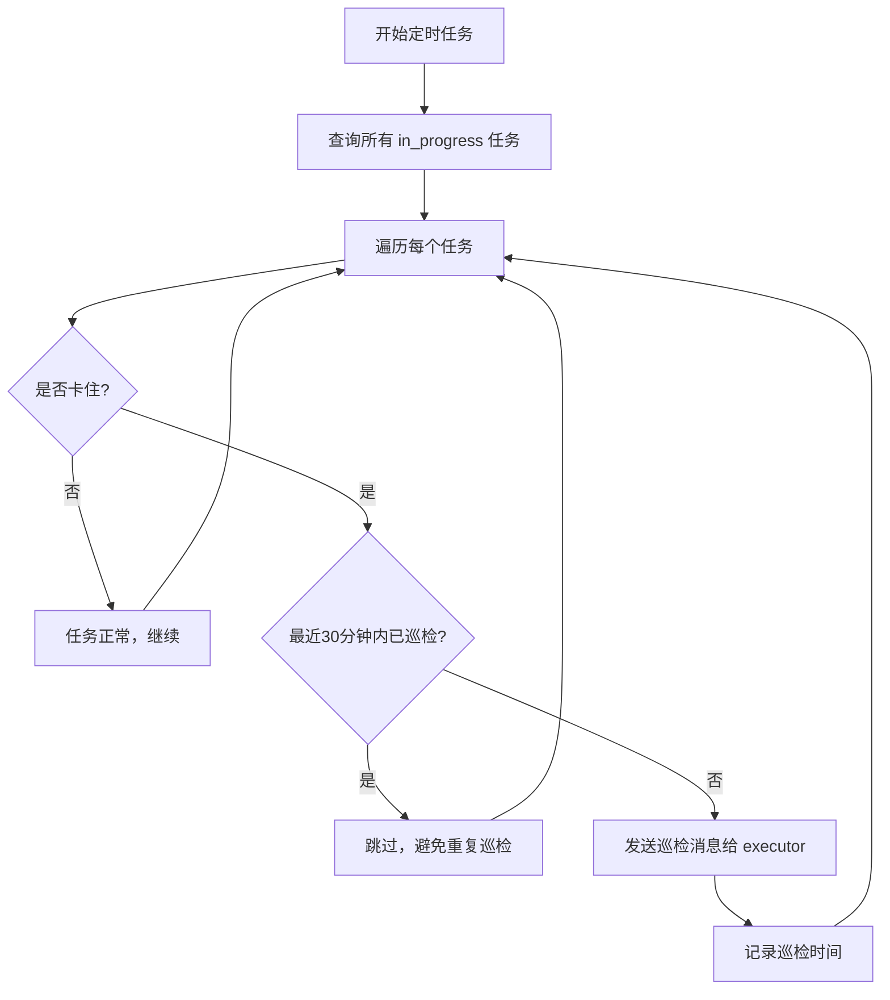
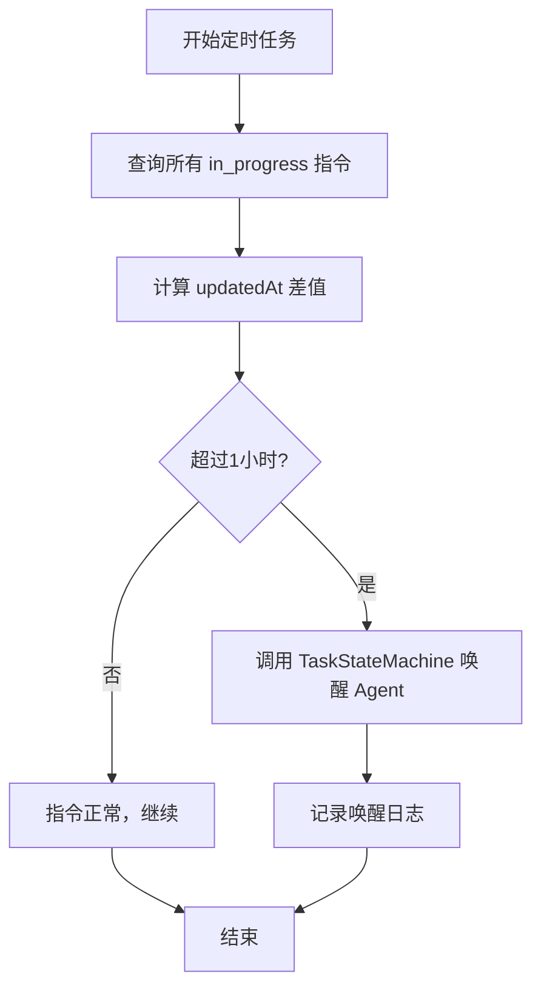
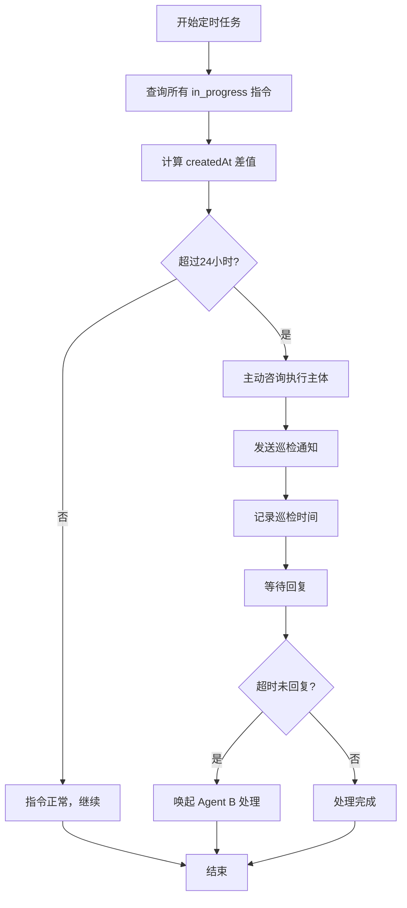
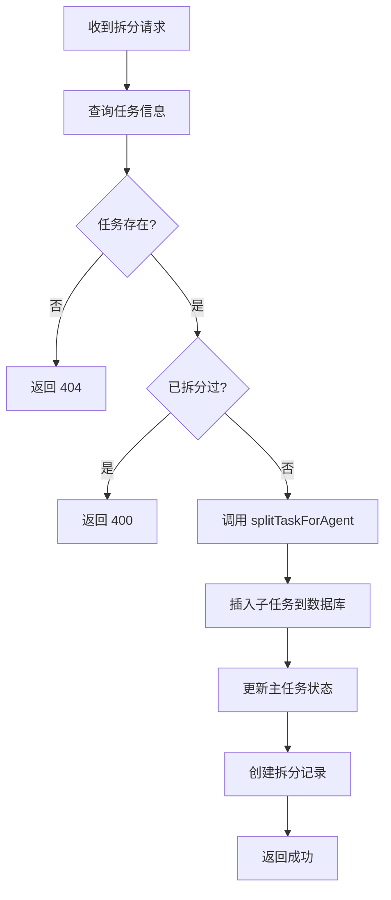
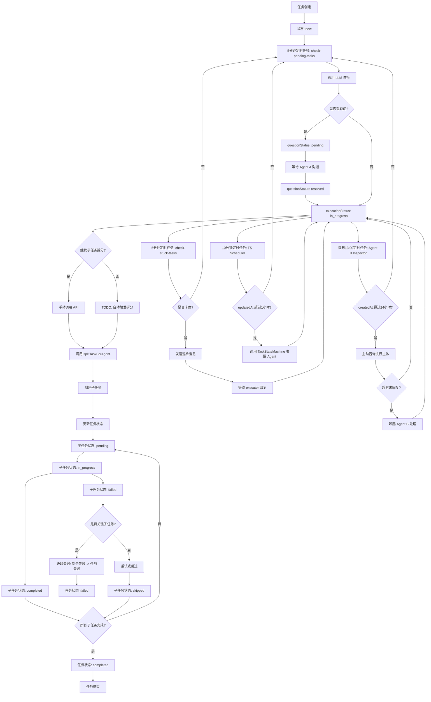

# 任务流转和触发机制文档

## 概述

本文档详细描述了多 Agent 协作系统中的任务流转、定时任务监控机制以及子任务拆分的完整触发逻辑。

## 1. 任务状态生命周期

### 1.1 任务状态 (commandResult.executionStatus)

| 状态 | 说明 | 触发条件 | 后续流程 |
|------|------|----------|----------|
| `new` | 新创建的任务 | 用户或系统创建任务 | 等待分配给 executor |
| `in_progress` | 执行中 | executor 确认无疑问 | 开始执行任务 |
| `completed` | 已完成 | 所有子任务完成或任务本身完成 | 任务结束 |
| `failed` | 失败 | 任务或关键子任务失败 | 触发失败恢复机制 |
| `paused` | 暂停 | executor 请求暂停 | 等待恢复 |

### 1.2 子任务状态 (agentSubTasks.status)

| 状态 | 说明 | 触发条件 | 后续流程 |
|------|------|----------|----------|
| `pending` | 等待执行 | 子任务创建完成 | 等待 executor 开始 |
| `in_progress` | 执行中 | executor 开始执行子任务 | 子任务进行中 |
| `completed` | 已完成 | 子任务执行完成 | 继续下一个子任务 |
| `failed` | 失败 | 子任务执行失败 | 触发失败级联 |
| `skipped` | 已跳过 | 非 key 子任务被跳过 | 继续下一个子任务 |
| `blocked` | 阻塞 | 依赖的前置任务未完成 | 等待前置任务 |

## 2. 定时任务监控机制

### 2.1 check-pending-tasks（5 分钟定时任务）

**目标**：扫描未确认的任务，分配给 executor 并询问是否有疑问

**触发条件**：每 5 分钟自动执行

**检查范围**：所有 `executionStatus = 'new'` 的任务

**处理流程**：



**关键代码**：

```typescript
// src/app/api/cron/check-pending-tasks/route.ts

// 1. 查询所有 status = 'new' 的任务
const tasks = await db
  .select()
  .from(commandResults)
  .where(eq(commandResults.executionStatus, 'new'));

// 2. 遍历每个任务
for (const task of tasks) {
  // 3. 调用 LLM 让 executor 自检是否有疑问
  const selfCheckResult = await agentSelfCheck(task.executor, task);

  // 4. 创建 session_id 和交互记录
  const sessionId = generateSessionId('task_assignment', task.executor);

  // 5. 判断后续流程
  if (selfCheckResult.hasQuestions) {
    // 有疑问，等待 Agent A 沟通
    await db.update(commandResults)
      .set({
        questionStatus: 'pending',
        lastCheckedAt: new Date(),
      })
      .where(eq(commandResults.id, task.id));
  } else {
    // 没有疑问，进入工作状态
    await db.update(commandResults)
      .set({
        executionStatus: 'in_progress',
        questionStatus: 'resolved',
        lastCheckedAt: new Date(),
      })
      .where(eq(commandResults.id, task.id));

    // TODO: 触发拆分子任务（将在下一步实现）
    // await triggerTaskSplitting(task.id, task.executor);
  }
}
```

**输出结果**：
- `assignedCount`: 处理的任务总数
- `questionCount`: 有疑问的任务数
- `okCount`: 没有疑问的任务数

---

### 2.2 check-stuck-tasks（5 分钟定时任务）

**目标**：扫描正在执行的任务，检查是否卡住并主动询问

**触发条件**：每 5 分钟自动执行

**检查范围**：所有 `executionStatus = 'in_progress'` 的任务

**判断标准**：`updatedAt` 超过 1 小时无进展

**处理流程**：



**关键代码**：

```typescript
// src/app/api/cron/check-stuck-tasks/route.ts

// 1. 扫描所有 status = 'in_progress' 的任务
const tasks = await db
  .select()
  .from(commandResults)
  .where(eq(commandResults.executionStatus, 'in_progress'));

// 2. 遍历每个任务
for (const task of tasks) {
  // 检查是否卡住
  const isStuck = await isTaskStuck(task);

  if (isStuck) {
    // 检查是否已经创建过巡检记录（避免重复巡检）
    const existingInspection = await db
      .select()
      .from(agentInteractions)
      .where(
        and(
          eq(agentInteractions.commandResultId, task.id),
          eq(agentInteractions.messageType, 'question'),
          eq(agentInteractions.sender, 'system'),
          eq(agentInteractions.receiver, task.executor),
          sql`${agentInteractions.metadata}->>'trigger' = 'check_stuck'`
        )
      )
      .orderBy(sql`${agentInteractions.createdAt} DESC`)
      .limit(1);

    // 如果最近 30 分钟内已经巡检过，跳过
    if (existingInspection.length > 0) {
      const lastInspectionTime = new Date(existingInspection[0].createdAt);
      const thirtyMinutesAgo = new Date(Date.now() - 30 * 60 * 1000);

      if (lastInspectionTime > thirtyMinutesAgo) {
        console.log(`⏭️ 任务 ${task.id} 最近 30 分钟内已巡检过，跳过`);
        continue;
      }
    }

    // 插入 system 巡检提问记录
    await db.insert(agentInteractions).values({
      commandResultId: task.id,
      taskDescription: task.taskName || task.commandContent?.substring(0, 100),
      sessionId: generateSessionId('inspection', 'system', task.executor),
      sender: 'system',
      receiver: task.executor,
      messageType: 'question',
      content: '你好，系统检测到你的任务卡住了（超过 1 小时未更新）。请问你遇到了什么问题？需要帮助吗？',
      roundNumber: 1,
      metadata: {
        trigger: 'check_stuck',
        stuckReason: '超过1小时未更新',
        inspectionTime: new Date().toISOString(),
      },
    });
  }
}
```

**输出结果**：
- `checkedCount`: 检查的任务总数
- `stuckCount`: 卡住的任务数

---

### 2.3 TS Scheduler（每 10 分钟）

**目标**：监控执行中的指令，判断 `updatedAt` 超过 1 小时无进展

**触发条件**：每 10 分钟自动执行

**检查范围**：所有 `executionStatus = 'in_progress'` 的指令

**判断标准**：`updatedAt` 超过 1 小时未更新

**处理流程**：



**关键代码**：

```typescript
// src/lib/services/ts-scheduler.ts

// 每 10 分钟检查一次
const STUCK_THRESHOLD_MS = 60 * 60 * 1000; // 1 小时

// 查询所有执行中的指令
const stuckCommands = await db
  .select()
  .from(commandResults)
  .where(eq(commandResults.executionStatus, 'in_progress'));

// 检查每个指令
for (const command of stuckCommands) {
  const updatedAt = new Date(command.updatedAt).getTime();
  const now = Date.now();
  const elapsed = now - updatedAt;

  if (elapsed > STUCK_THRESHOLD_MS) {
    console.log(`指令 ${command.commandId} 卡住了，触发唤醒机制`);

    // 调用 TaskStateMachine 唤醒 Agent
    await TaskStateMachine.recordAwakening(
      command.commandId,
      'ts_scheduler',
      `超过 ${Math.floor(elapsed / (60 * 60 * 1000))} 小时未更新`
    );
  }
}
```

---

### 2.4 Agent B Inspector（每日 13:00）

**目标**：监控执行中的指令，判断 `createdAt` 超过 24 小时

**触发条件**：每日 13:00 自动执行

**检查范围**：所有 `executionStatus = 'in_progress'` 的指令

**判断标准**：`createdAt` 超过 24 小时

**处理流程**：



**关键代码**：

```typescript
// src/lib/services/agent-b-inspector.ts

// 查询所有执行中的指令
const executingCommands = await db
  .select()
  .from(commandResults)
  .where(eq(commandResults.executionStatus, CommandStatus.IN_PROGRESS));

// 遍历每条指令
for (const command of executingCommands) {
  // 判断：指令创建时间是否超过 24 小时
  const createdTime = new Date(command.createdAt);
  const hoursSinceCreation = (Date.now() - createdTime.getTime()) / (1000 * 60 * 60);

  if (hoursSinceCreation >= 24) {
    console.log(`指令 ${command.commandId} 执行超过 24 小时，主动咨询执行主体`);

    // 主动咨询执行主体
    await this.consultExecutor(command);
  }
}

// 主动咨询执行主体
private static async consultExecutor(command: any) {
  const { commandId, executor, commandContent } = command;

  // 1. 发送通知
  const notification = await TaskStateMachine.notifyAgent(
    'agent B',
    executor,
    'system',
    `巡检咨询`,
    `指令「${commandContent}」已执行超过 24 小时，是否遇到困难？`,
    commandId
  );

  // 2. 记录巡检时间
  await db
    .update(commandResults)
    .set({
      lastInspectionTime: new Date(),
      updatedAt: new Date()
    })
    .where(eq(commandResults.commandId, commandId));

  // 3. 等待执行主体回复（模拟）
  // TODO: 实际实现中，这里需要等待执行主体的回复
}
```

**超时处理**：

```typescript
// 处理超时未回复的情况
private static async handleTimeout(command: any, timeoutMinutes: number = 30) {
  const { commandId, executor } = command;

  console.log(`指令 ${commandId} 巡检后 ${timeoutMinutes} 分钟内未回复`);

  // 1. 记录唤醒
  await TaskStateMachine.recordAwakening(
    commandId,
    'agent_b',
    `巡检咨询后 ${timeoutMinutes} 分钟内未回复`
  );

  // 2. 唤起 Agent B 处理
  await this.triggerAgentB(command, '巡检超时无回复');
}

// 唤起 Agent B 处理
private static async triggerAgentB(command: any, reason: string) {
  const { commandId, executor, commandContent } = command;

  // 1. 记录到 helpRecord
  const [currentCommand] = await db
    .select()
    .from(commandResults)
    .where(eq(commandResults.commandId, commandId));

  if (currentCommand) {
    const helpRecord = `${new Date().toISOString()} - Agent B 唤起：${reason}`;

    await db
      .update(commandResults)
      .set({
        helpRecord: `${currentCommand.helpRecord || ''}\n${helpRecord}`.trim(),
        updatedAt: new Date()
      })
      .where(eq(commandResults.commandId, commandId));
  }

  // 2. 通知 Agent B 自我处理
  await TaskStateMachine.notifyAgent(
    'system',
    'agent B',
    'system',
    `唤起处理`,
    `指令 ${commandId} 执行主体 ${executor} 巡检超时，请主动了解情况并协助解决`,
    commandId
  );
}
```

## 3. 子任务拆分触发逻辑

### 3.1 当前实现方式

#### 方式一：手动调用 API

**API 路由**：`POST /api/agents/[id]/subtasks`

**请求体**：
```json
{
  "commandResultId": "任务 ID"
}
```

**处理流程**：



**关键代码**：

```typescript
// src/app/api/agents/[id]/subtasks/route.ts

export async function POST(
  request: NextRequest,
  { params }: { params: Promise<{ id: string }> }
) {
  const { id: agentId } = await params;
  const { commandResultId } = await request.json();

  // 1. 查询任务信息
  const task = await db
    .select()
    .from(commandResults)
    .where(eq(commandResults.id, commandResultId))
    .then(rows => rows[0]);

  // 2. 检查是否已经拆分过
  if (task.subTaskCount && task.subTaskCount > 0) {
    return NextResponse.json({
      success: false,
      error: '任务已拆分',
    }, { status: 400 });
  }

  // 3. 调用 LLM 让 agent 拆分任务
  const subTasks = await splitTaskForAgent(agentId, task);

  // 4. 插入子任务到 agent_sub_tasks 表
  for (let i = 0; i < subTasks.length; i++) {
    await db.insert(agentSubTasks).values({
      commandResultId,
      agentId,
      taskTitle: subTasks[i].title,
      taskDescription: subTasks[i].description,
      status: 'pending',
      orderIndex: subTasks[i].orderIndex,
      metadata: {
        acceptanceCriteria: subTasks[i].acceptanceCriteria,
        isCritical: subTasks[i].isCritical || false,
        criticalReason: subTasks[i].criticalReason || '',
      },
    });
  }

  // 5. 更新 commandresult 表
  await db.update(commandResults)
    .set({
      subTaskCount: subTasks.length,
      completedSubTasks: 0,
      completedSubTasksDescription: '',
      executionStatus: 'in_progress',
    })
    .where(eq(commandResults.id, commandResultId));

  // 6. 创建拆分记录
  await db.insert(agentInteractions).values({
    commandResultId,
    sessionId: generateSessionId('task_assignment', agentId),
    sender: agentId,
    messageType: 'notification',
    content: `已拆分任务为 ${subTasks.length} 个子任务`,
    roundNumber: 1,
    metadata: {
      action: 'split_task',
      subTaskCount: subTasks.length,
    },
  });

  return NextResponse.json({
    success: true,
    subTaskCount: subTasks.length,
    subTasks,
  });
}
```

**返回结果**：
```json
{
  "success": true,
  "subTaskCount": 3,
  "subTasks": [
    {
      "title": "子任务标题",
      "description": "子任务描述",
      "orderIndex": 1,
      "acceptanceCriteria": "验收标准",
      "isCritical": true,
      "criticalReason": "关键原因"
    }
  ],
  "message": "成功拆分 3 个子任务"
}
```

---

#### 方式二：预留的自动触发（未实现）

在 `check-pending-tasks` 定时任务中预留了 TODO 注释，但没有实际触发子任务拆分：

```typescript
// src/app/api/cron/check-pending-tasks/route.ts

if (selfCheckResult.hasQuestions) {
  // 有疑问，等待 Agent A 沟通
  questionCount++;
} else {
  // 没有疑问，进入工作状态
  okCount++;

  // 更新任务状态为 in_progress
  await db.update(commandResults)
    .set({
      executionStatus: 'in_progress',
      questionStatus: 'resolved',
      lastCheckedAt: new Date(),
    })
    .where(eq(commandResults.id, task.id));

  // TODO: 触发拆分子任务（将在下一步实现）
  // await triggerTaskSplitting(task.id, task.executor);
}
```

**缺失的功能**：
- 没有实现 `triggerTaskSplitting` 函数
- 任务从 `new` 状态转移到 `in_progress` 状态后，不会自动触发子任务拆分
- 需要手动调用 API 才能拆分子任务

---

### 3.2 建议的自动触发逻辑

#### 触发时机

建议在以下时机自动触发子任务拆分：

1. **任务从 `new` 转移到 `in_progress` 时**
   - 在 `check-pending-tasks` 定时任务中
   - 当 executor 确认无疑问后，自动触发子任务拆分

2. **任务被手动分配给 executor 时**
   - 在任务创建或手动分配接口中
   - 当任务被分配给 executor 且 executor 确认后，自动触发子任务拆分

3. **任务恢复执行时**
   - 在任务恢复 API 中
   - 当暂停的任务被恢复时，如果未拆分，自动触发子任务拆分

#### 实现方案

```typescript
// src/lib/services/task-splitting-trigger.ts

/**
 * 触发任务拆分
 * @param commandResultId 任务 ID
 * @param agentId Agent ID
 */
export async function triggerTaskSplitting(
  commandResultId: number,
  agentId: string
): Promise<boolean> {
  try {
    console.log(`🔧 触发任务拆分：${commandResultId}, Agent: ${agentId}`);

    // 1. 查询任务信息
    const task = await db
      .select()
      .from(commandResults)
      .where(eq(commandResults.id, commandResultId))
      .then(rows => rows[0]);

    if (!task) {
      console.error(`❌ 任务不存在：${commandResultId}`);
      return false;
    }

    // 2. 检查是否已经拆分过
    if (task.subTaskCount && task.subTaskCount > 0) {
      console.log(`⏭️ 任务已拆分，跳过：${commandResultId}`);
      return true;
    }

    // 3. 检查任务状态是否允许拆分
    if (task.executionStatus !== 'in_progress') {
      console.error(`❌ 任务状态不允许拆分：${task.executionStatus}`);
      return false;
    }

    // 4. 调用 LLM 让 agent 拆分任务
    console.log(`🔍 调用 LLM 让 Agent ${agentId} 拆分任务...`);
    const subTasks = await splitTaskForAgent(agentId, task);
    console.log(`✅ Agent ${agentId} 拆分完成，子任务数量：${subTasks.length}`);

    // 5. 插入子任务到数据库
    for (let i = 0; i < subTasks.length; i++) {
      await db.insert(agentSubTasks).values({
        commandResultId,
        agentId,
        taskTitle: subTasks[i].title,
        taskDescription: subTasks[i].description,
        status: 'pending',
        orderIndex: subTasks[i].orderIndex,
        metadata: {
          acceptanceCriteria: subTasks[i].acceptanceCriteria,
          isCritical: subTasks[i].isCritical || false,
          criticalReason: subTasks[i].criticalReason || '',
        },
      });
    }

    // 6. 更新主任务状态
    await db.update(commandResults)
      .set({
        subTaskCount: subTasks.length,
        completedSubTasks: 0,
        completedSubTasksDescription: '',
        updatedAt: new Date(),
      })
      .where(eq(commandResults.id, commandResultId));

    // 7. 创建拆分记录
    await db.insert(agentInteractions).values({
      commandResultId,
      taskDescription: task.taskName || task.commandContent?.substring(0, 100),
      sessionId: generateSessionId('task_splitting', agentId),
      sender: 'system',
      messageType: 'notification',
      content: `自动拆分任务为 ${subTasks.length} 个子任务`,
      roundNumber: 1,
      metadata: {
        action: 'auto_split_task',
        subTaskCount: subTasks.length,
        trigger: 'cron_check_pending_tasks',
      },
    });

    console.log(`✅ 子任务创建完成`);
    return true;
  } catch (error) {
    console.error('❌ 触发任务拆分失败:', error);
    return false;
  }
}
```

#### 集成到定时任务

```typescript
// src/app/api/cron/check-pending-tasks/route.ts

import { triggerTaskSplitting } from '@/lib/services/task-splitting-trigger';

// ... 省略其他代码 ...

if (selfCheckResult.hasQuestions) {
  // 有疑问，等待 Agent A 沟通
  questionCount++;
} else {
  // 没有疑问，进入工作状态
  okCount++;

  // 更新任务状态为 in_progress
  await db.update(commandResults)
    .set({
      executionStatus: 'in_progress',
      questionStatus: 'resolved',
      lastCheckedAt: new Date(),
    })
    .where(eq(commandResults.id, task.id));

  // ✅ 触发拆分子任务
  const splitSuccess = await triggerTaskSplitting(task.id, task.executor);

  if (splitSuccess) {
    console.log(`✅ 任务 ${task.id} 自动拆分成功`);
  } else {
    console.log(`⚠️ 任务 ${task.id} 自动拆分失败`);
  }
}
```

## 4. 完整的任务流转图



## 5. 关键问题与建议

### 5.1 当前问题

1. **子任务拆分未自动触发**
   - 任务从 `new` 转移到 `in_progress` 后，不会自动触发子任务拆分
   - 需要手动调用 API 才能拆分子任务
   - 影响：增加了人工干预，降低了自动化程度

2. **定时任务职责重叠**
   - `check-stuck-tasks` 和 `TS Scheduler` 都监控执行中的指令
   - 判断标准略有不同（`updatedAt` vs `createdAt`）
   - 可能导致重复巡检或漏检

3. **巡检频率不一致**
   - `check-pending-tasks` 和 `check-stuck-tasks` 每 5 分钟执行
   - `TS Scheduler` 每 10 分钟执行
   - `Agent B Inspector` 每日 13:00 执行
   - 建议：统一巡检频率，避免混乱

### 5.2 改进建议

1. **实现自动触发子任务拆分**
   - 在 `check-pending-tasks` 中集成 `triggerTaskSplitting` 函数
   - 确保任务从 `new` 转移到 `in_progress` 后自动拆分
   - 减少人工干预，提高自动化程度

2. **优化定时任务职责**
   - 明确定时任务的监控范围和触发条件
   - 避免重复巡检，提高效率
   - 建议：
     - `check-pending-tasks`：仅扫描 `new` 任务
     - `check-stuck-tasks`：仅扫描 `in_progress` 任务（1 小时未更新）
     - `TS Scheduler`：合并到 `check-stuck-tasks` 中
     - `Agent B Inspector`：保留，用于长期监控（24 小时）

3. **统一巡检频率**
   - 建议统一为 5 分钟或 10 分钟
   - 避免因频率不一致导致的混乱

4. **增加子任务拆分的重试机制**
   - 如果子任务拆分失败，记录错误并重试
   - 避免因拆分失败导致任务卡住

5. **增加子任务拆分的缓存机制**
   - 相同任务的拆分结果可以缓存
   - 减少重复调用 LLM 的开销

## 6. API 接口汇总

### 6.1 定时任务接口

| 接口 | 方法 | 触发频率 | 功能 |
|------|------|----------|------|
| `/api/cron/check-pending-tasks` | GET | 每 5 分钟 | 扫描未确认的任务，分配给 executor |
| `/api/cron/check-stuck-tasks` | GET | 每 5 分钟 | 扫描正在执行的任务，检查是否卡住 |

### 6.2 子任务管理接口

| 接口 | 方法 | 功能 |
|------|------|------|
| `/api/agents/[id]/subtasks` | POST | 拆分子任务 |
| `/api/agents/[id]/subtasks/[subtaskId]` | PUT | 更新子任务进度 |

### 6.3 子任务状态管理接口

| 接口 | 方法 | 功能 |
|------|------|------|
| `/api/subtasks/[id]/status` | PUT | 更新子任务状态（支持级联处理） |
| `/api/subtasks/[id]/skip` | POST | 跳过非关键子任务 |
| `/api/subtasks/[id]/retry` | POST | 重试失败或阻塞的子任务 |

### 6.4 失败恢复接口

| 接口 | 方法 | 功能 |
|------|------|------|
| `/api/commands/[id]/recover` | POST | 恢复指令状态 |
| `/api/tasks/[id]/recover` | POST | 恢复任务状态 |

## 7. 数据库表结构

### 7.1 commandResults 表

| 字段 | 类型 | 说明 |
|------|------|------|
| id | number | 主键 |
| commandId | string | 指令 ID |
| executor | string | 执行者 |
| executionStatus | string | 执行状态（new, in_progress, completed, failed, paused） |
| questionStatus | string | 疑问状态（pending, resolved） |
| subTaskCount | number | 子任务数量 |
| completedSubTasks | number | 已完成子任务数量 |
| createdAt | Date | 创建时间 |
| updatedAt | Date | 更新时间 |
| lastCheckedAt | Date | 最后检查时间 |
| lastInspectionTime | Date | 最后巡检时间 |
| helpRecord | string | 帮助记录 |

### 7.2 agentSubTasks 表

| 字段 | 类型 | 说明 |
|------|------|------|
| id | number | 主键 |
| commandResultId | number | 关联的任务 ID |
| agentId | string | Agent ID |
| taskTitle | string | 子任务标题 |
| taskDescription | string | 子任务描述 |
| status | string | 子任务状态（pending, in_progress, completed, failed, skipped, blocked） |
| orderIndex | number | 顺序索引 |
| startedAt | Date | 开始时间 |
| completedAt | Date | 完成时间 |
| metadata | JSON | 元数据（包含 isCritical、criticalReason、acceptanceCriteria） |
| createdAt | Date | 创建时间 |
| updatedAt | Date | 更新时间 |

### 7.3 agentInteractions 表

| 字段 | 类型 | 说明 |
|------|------|------|
| id | number | 主键 |
| commandResultId | number | 关联的任务 ID |
| sessionId | string | 会话 ID |
| sender | string | 发送者 |
| receiver | string | 接收者 |
| messageType | string | 消息类型（question, answer, notification） |
| content | string | 消息内容 |
| roundNumber | number | 轮次 |
| isResolution | boolean | 是否为解决方案 |
| metadata | JSON | 元数据 |
| createdAt | Date | 创建时间 |

## 8. 总结

本文档详细描述了多 Agent 协作系统中的任务流转、定时任务监控机制以及子任务拆分的完整触发逻辑。

**关键要点**：

1. **定时任务监控**：
   - `check-pending-tasks`：每 5 分钟扫描 `new` 任务
   - `check-stuck-tasks`：每 5 分钟扫描 `in_progress` 任务（1 小时未更新）
   - `TS Scheduler`：每 10 分钟监控执行中的指令（1 小时未更新）
   - `Agent B Inspector`：每日 13:00 监控执行中的指令（24 小时）

2. **子任务拆分**：
   - 当前支持手动调用 API 拆分子任务
   - 预留了自动触发逻辑，但未实现
   - 建议在任务从 `new` 转移到 `in_progress` 后自动触发拆分

3. **任务流转**：
   - 任务从 `new` → `in_progress` → `completed`
   - 子任务从 `pending` → `in_progress` → `completed`
   - 支持失败级联和恢复机制

4. **改进建议**：
   - 实现自动触发子任务拆分
   - 优化定时任务职责
   - 统一巡检频率
   - 增加重试机制和缓存机制

**下一步行动**：

1. 实现 `triggerTaskSplitting` 函数
2. 在 `check-pending-tasks` 中集成自动触发拆分逻辑
3. 优化定时任务职责，避免重复巡检
4. 增加子任务拆分的重试机制和缓存机制
