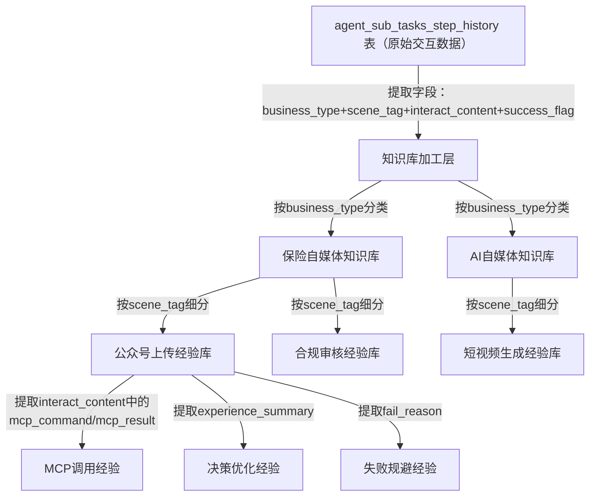

# 高度智能化的 Agent B 与执行 Agent 交互过程—— 重点讲数据如何存储

# 及 agent_sub_tasks_step_history 记录表详细设计
（适配保险自媒体，可复用至AI自媒体事业部，聚焦交互登记+知识沉淀核心定位）
# 执行案例 ：src>app>api>test>run-all-tests>route.tsroute.ts


## 一、设计核心修正与定位
### 核心修正
严格遵循你提出的核心要求：
1. **移除主表中 MCP 专属字段**：删除 `mcp_used`、`mcp_result` 字段，避免表职责偏离“智能体间全交互登记”核心定位；
2. **回归表的核心职责**：`agent_sub_tasks_step_history` 仅作为「智能体间所有交互的原始登记载体」，不绑定具体MCP逻辑，所有MCP相关信息均收纳至 `interact_content` 结构化字段中；
3. **强化知识沉淀原料属性**：表中所有字段均为“原始交互数据”，知识库的经验提炼、分类、复用均基于此表的原始数据，而非表结构直接承载知识库逻辑。
agent_sub_tasks_step_history
### 核心定位
1.  表的唯一职责：**完整、结构化登记 Agent B 与执行 Agent 之间的所有交互内容**（请求、响应、上报、人工重试），不区分交互是否涉及MCP，确保原始数据无遗漏；
2.  知识沉淀逻辑：知识库的所有经验（包括MCP调用经验、纯决策经验、上报经验）均从该表的 `interact_content`、`scene_tag`、`business_type` 等原始字段中提炼，表仅提供“原料”，不承担“加工后知识库”的存储职责；
3.  多事业部适配：通过 `business_type`、`scene_tag` 对原始交互数据做标签化登记，为后续保险/AI自媒体事业部的知识库提炼提供统一的原始数据基础。

## 二、修正后 agent_sub_tasks_step_history 表结构设计
### 表结构（聚焦交互登记，移除MCP专属字段）
| 字段名 | 字段类型 | 是否非空 | 默认值 | 核心用途 | 设计说明（修正后） |
|--------|----------|----------|--------|----------|--------------------|
| id | bigint | 是 | 自增 | 主键ID，唯一标识一条交互记录 | 通用，所有交互记录唯一标识 |
| task_id | varchar(64) | 是 | - | 关联`agent_sub_tasks`表的子任务ID | 绑定业务任务，便于按任务追溯全交互链路 |
| step_no | int | 是 | 1 | 子任务重试步骤 | 区分同一任务的不同重试轮次 |
| interact_type | varchar(32) | 是 | - | 交互类型枚举：<br>1. request（执行Agent请求）<br>2. response（Agent B响应）|
| interact_num | int | 是 | 1 | 同`task_id+step_no`下的交互编号 | 同一重试步骤内的交互计数，一次“请求+响应”共用同一编号 |
| agent_type | varchar(32) | 是 | - | 执行Agent类型枚举：<br>insurance-d（保险自媒体）<br>ai-media-d（AI自媒体） | 区分执行Agent所属事业部 |
| business_type | varchar(32) | 是 | - | 业务类型枚举：<br>insurance_media（保险自媒体）<br>ai_media（AI自媒体） | 标签化原始数据，为知识库按业务分类提供依据 |
| scene_tag | varchar[] | 否 | '{}'::varchar[] | 场景标签：如["公众号上传","合规审核","短视频生成"] | 精细化标签，支撑知识库按场景提炼经验 |
| interact_content | jsonb | 是 | '{}'::jsonb | 结构化存储所有交互内容（含MCP相关信息） | 核心字段，所有MCP、决策、上报信息均收纳于此，保证表结构简洁 |
| success_flag | tinyint | 否 | NULL | 本次交互是否成功：1=成功，0=失败，NULL=未完成 | 标记交互结果，为知识库筛选成功/失败经验提供依据 |
| fail_reason | varchar(500) | 否 | NULL | 失败原因（标准化描述） | 原始失败信息，知识库提炼失败经验的原料 |
| experience_used | jsonb | 否 | '{}'::jsonb | 本次交互引用的历史经验（关联本表格历史记录ID） | 记录“经验复用”的原始轨迹，为知识库分析复用效果提供依据 |
| report_flag | tinyint | 是 | 0 | 是否为上报相关记录：0=否，1=是 | 标记上报类交互，不影响表的核心交互登记职责 |
| create_time | datetime | 是 | CURRENT_TIMESTAMP | 记录创建时间 | 原始数据时间戳，支撑知识库按时间维度分析 |
| update_time | datetime | 是 | CURRENT_TIMESTAMP | 记录更新时间 | 交互内容更新（如响应补充、经验引用）时同步更新 |

### 修正后建表SQL
```sql
CREATE TABLE agent_sub_tasks_step_history (
  id BIGSERIAL PRIMARY KEY,
  task_id VARCHAR(64) NOT NULL,
  step_no INT NOT NULL DEFAULT 1,
  interact_type VARCHAR(32) NOT NULL,
  interact_num INT NOT NULL DEFAULT 1,
  agent_type VARCHAR(32) NOT NULL,
  business_type VARCHAR(32) NOT NULL,
  scene_tag VARCHAR[] DEFAULT '{}'::varchar[],
  interact_content JSONB NOT NULL DEFAULT '{}'::jsonb,
  success_flag TINYINT,
  fail_reason VARCHAR(500),
  experience_used JSONB DEFAULT '{}'::jsonb,
  report_flag TINYINT NOT NULL DEFAULT 0,
  create_time TIMESTAMP NOT NULL DEFAULT CURRENT_TIMESTAMP,
  update_time TIMESTAMP NOT NULL DEFAULT CURRENT_TIMESTAMP
);

-- 索引优化（聚焦交互登记+知识沉淀检索）
CREATE INDEX idx_task_step_num ON agent_sub_tasks_step_history (task_id, step_no, interact_num); -- 按任务追溯交互
CREATE INDEX idx_business_scene ON agent_sub_tasks_step_history (business_type, scene_tag); -- 按业务/场景提炼知识库
CREATE INDEX idx_interact_type ON agent_sub_tasks_step_history (interact_type); -- 按交互环节筛选数据
CREATE INDEX idx_success_flag ON agent_sub_tasks_step_history (success_flag); -- 筛选成功/失败经验原料
CREATE INDEX idx_experience_used ON agent_sub_tasks_step_history ((experience_used->>'history_ids')); -- 追溯经验复用轨迹
```

## 三、标准化交互内容（interact_content）设计（MCP信息收纳其中）
### 核心设计原则
所有MCP相关信息（调用指令、执行结果）均作为“交互内容的一部分”收纳至 `interact_content`，表结构仅保留“交互登记”的通用字段，确保：
1.  表职责纯粹：只登记交互，不绑定具体业务逻辑（如MCP）；
2.  数据结构化：MCP信息在JSON内按固定格式存储，不影响原始数据的可读性；
3.  知识库适配：从JSON中提取MCP相关字段，即可提炼MCP调用经验，不改动表结构。

### 3.1 执行Agent 标准化请求（interact_type=request）
#### 格式说明


### 3.2 Agent B 标准化响应（interact_type=response）
#### 场景1：有经验+有MCP，输出MCP调用指令


### 3.3 其他交互类型（上报、人工重试）
- **上报登记（interact_type=request）**：无MCP相关信息时，`interact_content` 仅存储上报原因、决策依据等，表结构无需调整；
- **人工重试（interact_type=response）**：人工建议中涉及MCP配置的，收纳至 `retry_body.user_suggestion.modify_params`，表结构无感知。

## 四、知识沉淀与表的联动逻辑（核心修正后）
### 4.1 知识库的“原料-加工”逻辑


### 4.2 核心联动规则
1.  **原始数据层（表）**：仅登记“是什么”（交互内容、场景、结果），不处理“怎么用”（经验提炼）；
2.  **知识库加工层**：从表中提取 `business_type`（业务分类）、`scene_tag`（场景分类）、`interact_content`（交互细节）、`success_flag`（结果），按规则提炼经验：
    - MCP调用经验：提取 `interact_content` 中的 `mcp_command`、`mcp_result`，总结“哪些MCP适配哪些场景、参数如何配置成功率高”；
    - 决策优化经验：提取 `interact_content` 中的 `experience_used`、`final_result.experience_summary`，总结“哪些历史经验复用效果好”；
    - 失败规避经验：提取 `fail_reason`、`interact_content` 中的失败细节，总结“常见失败场景及规避方法”；
3.  **经验复用层**：Agent B决策时，从知识库中匹配经验，再将“引用的经验ID”登记至表的 `experience_used` 字段，形成“原始数据→知识库→原始数据”的闭环。

## 五、核心约束与规范（修正后）
### 5.1 表设计约束
1.  表中**禁止新增任何业务专属字段**（如MCP、AI生成等），所有业务细节均收纳至 `interact_content`；
2.  `interact_content` 必须遵循标准化JSON格式，确保知识库加工层可自动化提取字段；
3.  `business_type`、`scene_tag` 必须准确标注，为知识库分类提供可靠依据；
4.  表仅存储“原始交互数据”，不存储加工后的经验（如“MCP调用最佳实践”），经验仅在知识库层存储。

### 5.2 交互登记约束
1.  无论是否涉及MCP，所有智能体间的交互必须登记至表中，确保原始数据完整；
2.  MCP相关信息仅作为交互内容的一部分，不影响表的“全交互登记”核心职责；
3.  `success_flag` 标记的是“本次交互是否达成目标”（如请求→响应闭环），而非“MCP是否执行成功”，MCP执行结果在 `interact_content` 中单独标记。

## 六、总结（修正后核心要点）
### 核心修正点
1.  移除主表 `mcp_used`、`mcp_result` 字段，回归表“智能体间全交互登记”的核心职责；
2.  所有MCP相关信息收纳至 `interact_content` 结构化字段，表结构简洁且通用；
3.  强化表的“知识沉淀原料”属性，知识库逻辑与表结构解耦，适配多事业部拓展。

### 核心价值
1.  **表职责纯粹**：仅做交互登记，不绑定具体业务逻辑（MCP/AI生成），可适配保险/AI自媒体等多事业部；
2.  **数据结构化**：标准化的 `interact_content` 既保证原始数据完整，又支持知识库自动化加工；
3.  **拓展性强**：新增业务场景（如AI自媒体短视频生成）时，仅需扩展 `scene_tag` 枚举、调整 `interact_content` 内的业务参数，无需修改表结构。

所有设计均聚焦“交互登记为核心，知识沉淀为目标”，既满足当前保险自媒体业务需求，又为后续AI自媒体事业部的拓展提供了统一、灵活的原始数据基础。